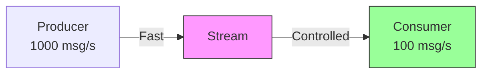

# Backpressure

Control message processing rate to prevent resource exhaustion.

## What is Backpressure?

**Backpressure** is the ability to control the rate at which messages are consumed to prevent overwhelming system resources.



## Configuration Options

### Batch Size

Number of messages fetched per read:

```typescript
@StreamConsumer({
  stream: 'orders',
  group: 'processors',
  batchSize: 10,  // Fetch 10 messages at a time
})
```

**Effects:**

- **Small batches (1-10)**: Lower latency, more network overhead
- **Large batches (50-100)**: Higher throughput, more memory usage

### Concurrency

Number of messages processed simultaneously:

```typescript
@StreamConsumer({
  stream: 'orders',
  group: 'processors',
  concurrency: 5,  // Process 5 messages in parallel
})
```

**Effects:**

- **Low concurrency (1-5)**: Lower resource usage, slower throughput
- **High concurrency (10-50)**: Higher throughput, more CPU/memory

### Block Timeout

Time to wait for new messages (milliseconds):

```typescript
@StreamConsumer({
  stream: 'orders',
  group: 'processors',
  blockTimeout: 5000,  // Wait 5 seconds for new messages
})
```

**Effects:**

- **Short timeout (100-1000ms)**: Quick response to new messages, more CPU
- **Long timeout (5000-30000ms)**: Less CPU overhead, higher latency

## Tuning for Different Workloads

### CPU-Bound Tasks

Tasks that use CPU (calculations, parsing):

```typescript
@StreamConsumer({
  stream: 'analytics',
  group: 'calculators',
  batchSize: 10,
  concurrency: os.cpus().length,  // Match CPU cores
  blockTimeout: 5000,
})
async processAnalytics(message: IStreamMessage<AnalyticsEvent>) {
  // CPU-intensive calculation
  const result = await this.computeComplexMetrics(message.data);
  await message.ack();
}
```

### I/O-Bound Tasks

Tasks that wait for external services (HTTP, database):

```typescript
@StreamConsumer({
  stream: 'emails',
  group: 'senders',
  batchSize: 50,              // Large batches
  concurrency: 20,            // High concurrency for I/O wait
  blockTimeout: 1000,
})
async sendEmail(message: IStreamMessage<Email>) {
  // I/O-bound - network request
  await this.emailProvider.send(message.data);
  await message.ack();
}
```

### Memory-Intensive Tasks

Tasks that use lots of memory:

```typescript
@StreamConsumer({
  stream: 'images',
  group: 'processors',
  batchSize: 5,               // Small batches
  concurrency: 2,             // Low concurrency
  blockTimeout: 10000,
})
async processImage(message: IStreamMessage<ImageData>) {
  // Memory-intensive - load large image
  const image = await this.loadImage(message.data);
  await this.transform(image);
  await message.ack();
}
```

## Dynamic Backpressure

Adjust processing based on system load:

<<< @/apps/demo/src/plugins/streams/service-backpressure-dynamic.usage.ts{typescript}

## Rate Limiting

Limit messages processed per second:

```typescript
import { RateLimiterMemory } from 'rate-limiter-flexible';

@Injectable()
export class RateLimitedConsumer {
  private rateLimiter = new RateLimiterMemory({
    points: 100,    // 100 messages
    duration: 1,    // per second
  });

  @StreamConsumer({
    stream: 'notifications',
    group: 'senders',
    batchSize: 10,
    concurrency: 5,
  })
  async handle(message: IStreamMessage<Notification>) {
    try {
      // Wait for rate limiter
      await this.rateLimiter.consume('notification-send', 1);

      // Process message
      await this.send(message.data);
      await message.ack();
    } catch (error) {
      // Rate limit exceeded - wait and retry
      if (error instanceof Error && error.message.includes('rate limit')) {
        await this.sleep(1000);
        await message.reject(error);
      } else {
        throw error;
      }
    }
  }
}
```

## Circuit Breaker

Stop processing when downstream service fails (using any circuit breaker library):

```typescript
@Injectable()
export class CircuitBreakerConsumer {
  // Example: use a circuit breaker library (e.g., opossum)
  private breaker = new CircuitBreaker({
    failureThreshold: 5,     // Open after 5 failures
    timeout: 10000,          // 10s timeout
    resetTimeout: 60000,     // Try again after 1 minute
  });

  @StreamConsumer({
    stream: 'webhooks',
    group: 'senders',
    batchSize: 10,
    concurrency: 5,
  })
  async handle(message: IStreamMessage<Webhook>) {
    if (this.breaker.isOpen()) {
      // Circuit open - delay processing
      this.logger.warn('Circuit open, delaying message');
      await this.sleep(60000);  // Wait 1 minute
      await message.reject(new Error('Circuit open'));
      return;
    }

    try {
      await this.breaker.execute(() =>
        this.sendWebhook(message.data)
      );
      await message.ack();
    } catch (error) {
      await message.reject(error);
    }
  }
}
```

## Monitoring and Metrics

Track processing metrics:

<<< @/apps/demo/src/plugins/streams/service-backpressure-monitored.usage.ts{typescript}

## Best Practices

### 1. Start Conservative

```typescript
// Start with low values
@StreamConsumer({
  batchSize: 10,
  concurrency: 1,
  blockTimeout: 5000,
})
```

Then increase based on monitoring.

### 2. Match Workload Type

| Workload | Batch Size | Concurrency | Block Timeout |
|----------|------------|-------------|---------------|
| CPU-bound | 10-20 | # of CPU cores | 5000ms |
| I/O-bound | 50-100 | 10-50 | 1000ms |
| Memory-intensive | 5-10 | 2-5 | 10000ms |
| Mixed | 20-30 | 5-10 | 5000ms |

### 3. Monitor System Resources

```typescript
@Cron('*/1 * * * *')  // Every minute
async checkResources() {
  const cpu = await this.getSystemCPUUsage();
  const memory = await this.getSystemMemUsage();

  if (cpu > 80 || memory > 80) {
    this.logger.warn('High resource usage, consider reducing concurrency');
  }
}
```

### 4. Use Graceful Shutdown

<<< @/apps/demo/src/plugins/streams/service-backpressure-graceful.usage.ts{typescript}

### 5. Set Appropriate Claim Timeout

Configure at module level:

```typescript
new StreamsPlugin({
  consumer: {
    claimIdleTimeout: 30000,  // Claim messages idle > 30s
  },
})
```

## Troubleshooting

### High CPU Usage

**Symptom:** CPU at 100%

**Solutions:**
- Reduce `concurrency`
- Increase `blockTimeout` to reduce polling
- Add processing delays

### High Memory Usage

**Symptom:** Memory continuously growing

**Solutions:**
- Reduce `batchSize`
- Reduce `concurrency`
- Check for memory leaks in handler

### Slow Processing

**Symptom:** Messages piling up in stream

**Solutions:**
- Increase `concurrency`
- Increase `batchSize`
- Add more consumer instances
- Optimize handler code

### Messages Timing Out

**Symptom:** Messages repeatedly timing out

**Solutions:**
- Increase processing timeout
- Reduce concurrency to avoid resource contention
- Add circuit breaker for failing downstream services

## Next Steps

- [Patterns](./patterns) — Common streaming patterns
- [Monitoring](./monitoring) — Track performance
