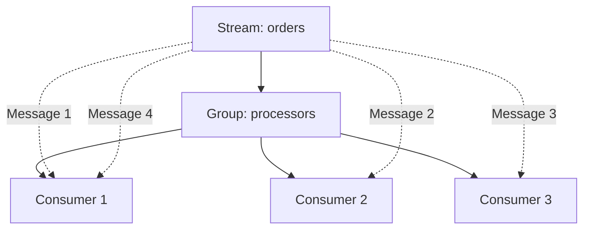
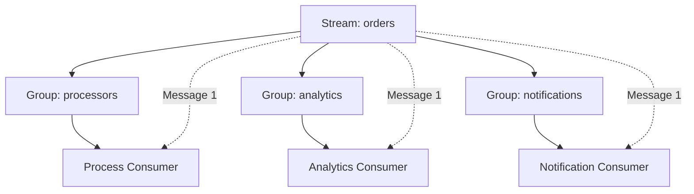
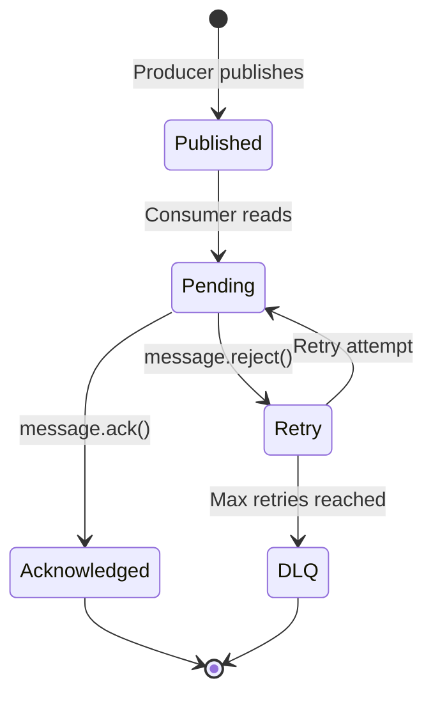
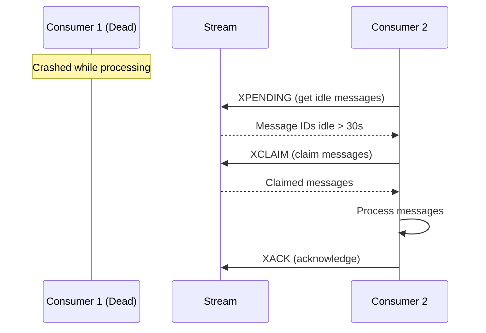

# Core Concepts

Understand how Redis Streams works.

## What are Redis Streams?

Redis Streams is an **append-only log data structure** that models a series of events:

```
Stream: orders
┌─────────────────────────┐
│ 1706123456789-0: {...}  │ ← Oldest
│ 1706123456790-0: {...}  │
│ 1706123456791-0: {...}  │
│ 1706123456792-0: {...}  │ ← Newest
└─────────────────────────┘
```

### Key Properties

- **Ordered** — Messages maintain insertion order
- **Durable** — Persist in Redis memory/disk
- **Replayable** — Read from any point in history
- **Partitionable** — Consumer groups distribute work

## Message Structure

Each message has:

**Message ID** — Unique identifier with format `timestamp-sequence`:

```
1706123456789-0
└────┬─────┘ │
     │       └─ Sequence number (0-based)
     └───────── Unix timestamp (milliseconds)
```

**Data** — Key-value pairs (stored as Redis hash):

```typescript
{
  type: 'ORDER_CREATED',
  orderId: 'order-123',
  customerId: 'cust-456',
  total: 99.99,
}
```

## Consumer Groups

Consumer groups enable **load balancing** and **fan-out** patterns.

### Load Balancing (Same Group)

Multiple consumers in the same group share messages:



### Fan-out (Different Groups)

Multiple groups each receive all messages:



## Message States

Messages go through these states:



### Published

Message exists in stream but not yet read by any consumer.

### Pending

Message delivered to a consumer but not yet acknowledged:

```bash
# Redis PEL (Pending Entry List)
XPENDING orders processors
# 1) (integer) 5          ← 5 pending messages
# 2) "1706123456789-0"    ← Oldest pending ID
# 3) "1706123456793-0"    ← Newest pending ID
# 4) 1) 1) "worker-1"     ← Consumer name
#       2) "3"            ← 3 messages pending
```

### Acknowledged

Consumer called `message.ack()`, message removed from PEL.

### Dead Letter Queue

Message failed max retries, moved to DLQ stream.

## Reading Messages

### New Messages Only

Start from the end of stream:

```typescript
// Group starts reading from '$' (end)
await consumer.createGroup('orders', 'processors', '$');
```

```
Stream: orders
┌─────────────────────────┐
│ 1706123456789-0         │
│ 1706123456790-0         │
│ 1706123456791-0         │
├─────────────────────────┤ ← '$' (start here)
│ 1706123456792-0         │ ✓ Read
│ 1706123456793-0         │ ✓ Read
└─────────────────────────┘
```

### All Messages

Start from beginning:

```typescript
// Group starts reading from '0' (beginning)
await consumer.createGroup('orders', 'processors', '0');
```

```
Stream: orders
├─────────────────────────┤ ← '0' (start here)
│ 1706123456789-0         │ ✓ Read
│ 1706123456790-0         │ ✓ Read
│ 1706123456791-0         │ ✓ Read
│ 1706123456792-0         │ ✓ Read
│ 1706123456793-0         │ ✓ Read
└─────────────────────────┘
```

### From Specific ID

Start from a specific message:

```typescript
await consumer.createGroup('orders', 'processors', '1706123456790-0');
```

## Pending Messages

Messages delivered to a consumer but not acknowledged.

### Why Messages Become Pending

1. **Consumer processing** — Normal state while processing
2. **Consumer crashed** — Consumer died before ACK
3. **Processing error** — Exception thrown, not yet retried
4. **Stuck message** — Bug in handler code

### Claiming Idle Messages

Claim messages from dead consumers:

```typescript
// Claim messages idle for 30 seconds
const claimed = await consumer.claimIdle(
  'orders',
  'processors',
  'new-consumer',
  30000,  // 30 seconds
);
```



## Stream Trimming

Limit stream size to prevent unbounded growth.

### MAXLEN Strategy

Keep only N most recent messages:

```typescript
await producer.publish('orders', data, { maxLen: 10000 });
```

```
Before trim (11,000 messages):
┌─────────────────────────┐
│ ... (1,000 old msgs)    │ ← Trimmed
├─────────────────────────┤
│ ... (10,000 recent)     │ ← Kept
└─────────────────────────┘

After trim (10,000 messages):
┌─────────────────────────┐
│ ... (10,000 recent)     │ ← Kept
└─────────────────────────┘
```

### MINID Strategy

Delete messages older than a given ID. The `IStreamProducer.trim()` method only supports MAXLEN. For MINID, use raw Redis:

```bash
redis-cli XTRIM orders MINID 1706000000000-0
```

## Backpressure

Control message processing rate:

### Batch Size

Number of messages fetched at once:

```typescript
@StreamConsumer({
  stream: 'orders',
  group: 'processors',
  batchSize: 50,  // Fetch 50 at a time
})
```

### Concurrency

Number of messages processed in parallel:

```typescript
@StreamConsumer({
  stream: 'orders',
  group: 'processors',
  concurrency: 10,  // Process 10 simultaneously
})
```

### Block Timeout

How long to wait for new messages:

```typescript
@StreamConsumer({
  stream: 'orders',
  group: 'processors',
  blockTimeout: 5000,  // Wait 5 seconds
})
```

## Next Steps

- [Configuration](./configuration) — Configure streams
- [Producer](./producer) — Publish messages
- [Consumer](./consumer) — Consume messages
