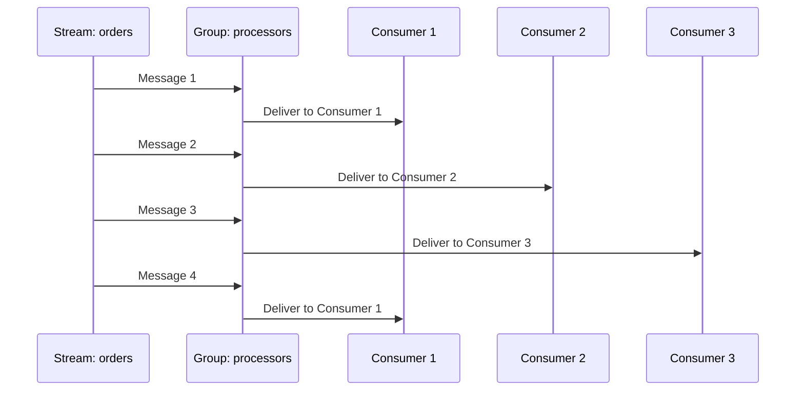
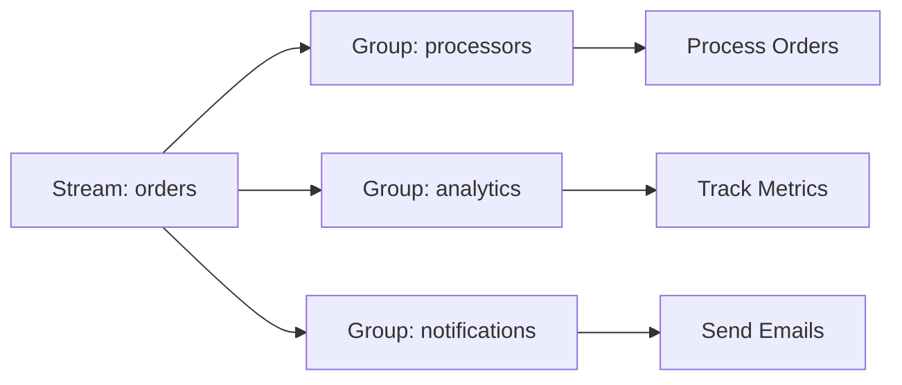

# Consumer Groups

Coordinate multiple consumers with consumer groups.

## Creating Consumer Groups

### Automatic Creation

The `@StreamConsumer` decorator creates groups automatically:

```typescript
@Injectable()
export class OrderProcessor {
  @StreamConsumer({
    stream: 'orders',
    group: 'processors',  // Created automatically
  })
  async handle(message: IStreamMessage<Order>): Promise<void> {
    await this.processOrder(message.data);
    await message.ack();
  }
}
```

### Manual Creation

Create groups with specific starting positions:

<<< @/apps/demo/src/plugins/streams/service-group-setup.usage.ts{typescript}

## Load Balancing Pattern

Multiple consumers in the same group share work:



### Implementation

```typescript
// Worker 1
@StreamConsumer({
  stream: 'orders',
  group: 'processors',
  consumer: 'worker-1',
  concurrency: 5,
})
async handleWorker1(message: IStreamMessage<Order>) {
  await this.process(message.data);
  await message.ack();
}

// Worker 2
@StreamConsumer({
  stream: 'orders',
  group: 'processors',
  consumer: 'worker-2',
  concurrency: 5,
})
async handleWorker2(message: IStreamMessage<Order>) {
  await this.process(message.data);
  await message.ack();
}
```

**Result:** Messages distributed evenly, 10 concurrent operations total.

## Fan-out Pattern

Multiple groups each receive all messages:



### Implementation

```typescript
// Order processing
@StreamConsumer({ stream: 'orders', group: 'processors' })
async processOrder(message: IStreamMessage<Order>) {
  await this.orderService.fulfill(message.data);
  await message.ack();
}

// Analytics
@StreamConsumer({ stream: 'orders', group: 'analytics' })
async trackMetrics(message: IStreamMessage<Order>) {
  await this.analyticsService.track(message.data);
  await message.ack();
}

// Notifications
@StreamConsumer({ stream: 'orders', group: 'notifications' })
async sendNotification(message: IStreamMessage<Order>) {
  await this.emailService.sendConfirmation(message.data);
  await message.ack();
}
```

**Result:** Each group processes all messages independently.

## Pending Messages

Messages delivered but not yet acknowledged.

### Check Pending Count

```typescript
const pending = await this.consumer.getPending('orders', 'processors');

console.log({
  total: pending.count,
  oldest: pending.minId,
  newest: pending.maxId,
  consumers: pending.consumers,  // Per-consumer counts
});

// Output:
// {
//   total: 15,
//   oldest: '1706123456789-0',
//   newest: '1706123456799-0',
//   consumers: [
//     { name: 'worker-1', pending: 10 },
//     { name: 'worker-2', pending: 5 },
//   ]
// }
```

### Pending Info

The `getPending()` method returns summary info:

```typescript
const pending = await this.consumer.getPending('orders', 'processors');

console.log({
  count: pending.count,        // Total pending
  minId: pending.minId,        // Oldest pending ID
  maxId: pending.maxId,        // Newest pending ID
  consumers: pending.consumers, // Per-consumer counts
});

// For detailed per-message inspection, use Redis CLI:
// redis-cli XPENDING orders processors - + 10
```

## Claiming Idle Messages

Claim messages from dead or slow consumers.

### Auto-Claim via Module Config

Configure the idle timeout for claiming abandoned messages at the module level:

```typescript
new StreamsPlugin({
  consumer: {
    claimIdleTimeout: 30000,  // Claim messages idle > 30s
  },
})
```

The consumer decorator works as usual:

```typescript
@StreamConsumer({
  stream: 'orders',
  group: 'processors',
})
async handle(message: IStreamMessage<Order>) {
  await this.process(message.data);
  await message.ack();
}
```

### Manual Claim

```typescript
// Claim idle messages (idle > 30 seconds)
const claimed = await this.consumer.claimIdle(
  'orders',
  'processors',
  'worker-new',  // New consumer taking over
  30000,         // Min idle time (ms)
);

console.log(`Claimed ${claimed.length} messages`);
```

### Claim and Process

<<< @/apps/demo/src/plugins/streams/service-claim-idle.usage.ts{typescript}

## Group Information

Use Redis CLI or the Redis driver directly for group/consumer introspection:

```bash
# List groups
redis-cli XINFO GROUPS orders

# List consumers in a group
redis-cli XINFO CONSUMERS orders processors
```

## Scaling Consumers

### Horizontal Scaling

Add more consumer instances:

```bash
# Server 1
node dist/main.js  # Consumer: worker-1

# Server 2
node dist/main.js  # Consumer: worker-2

# Server 3
node dist/main.js  # Consumer: worker-3
```

All consumers in the same group share work automatically.

### Vertical Scaling

Increase concurrency per consumer:

```typescript
@StreamConsumer({
  stream: 'orders',
  group: 'processors',
  concurrency: 20,  // Process 20 messages simultaneously
  batchSize: 50,    // Fetch 50 at a time
})
async handle(message: IStreamMessage<Order>) {
  await this.process(message.data);
  await message.ack();
}
```

## Cleanup

Use Redis CLI for group/consumer management:

```bash
# Delete inactive consumer from group
redis-cli XGROUP DELCONSUMER orders processors worker-old

# Delete entire group (removes all pending tracking)
redis-cli XGROUP DESTROY orders processors
```

::: warning Warning
Deleting a group removes all pending message tracking. Messages remain in the stream.
:::

## Best Practices

**1. Use descriptive group names:**

```typescript
// ✅ Good
'order-processors'
'analytics-trackers'
'email-senders'

// ❌ Bad
'group1'
'consumers'
```

**2. Set appropriate idle timeout:**

```typescript
// For fast operations (< 1s)
claimIdleTimeout: 10000  // 10 seconds

// For slow operations (minutes)
claimIdleTimeout: 300000  // 5 minutes
```

**3. Monitor pending messages:**

```typescript
@Cron('*/5 * * * *')  // Every 5 minutes
async checkPendingMessages() {
  const pending = await this.consumer.getPending('orders', 'processors');

  if (pending.count > 1000) {
    this.alertService.send('High pending message count');
  }
}
```

**4. Clean up dead consumers:**

```bash
# Check for idle consumers
redis-cli XINFO CONSUMERS orders processors

# Delete consumers idle > 1 hour manually
redis-cli XGROUP DELCONSUMER orders processors dead-worker
```

## Next Steps

- [Dead Letter Queue](./dead-letter-queue) — Handle failed messages
- [Monitoring](./monitoring) — Track consumer groups
