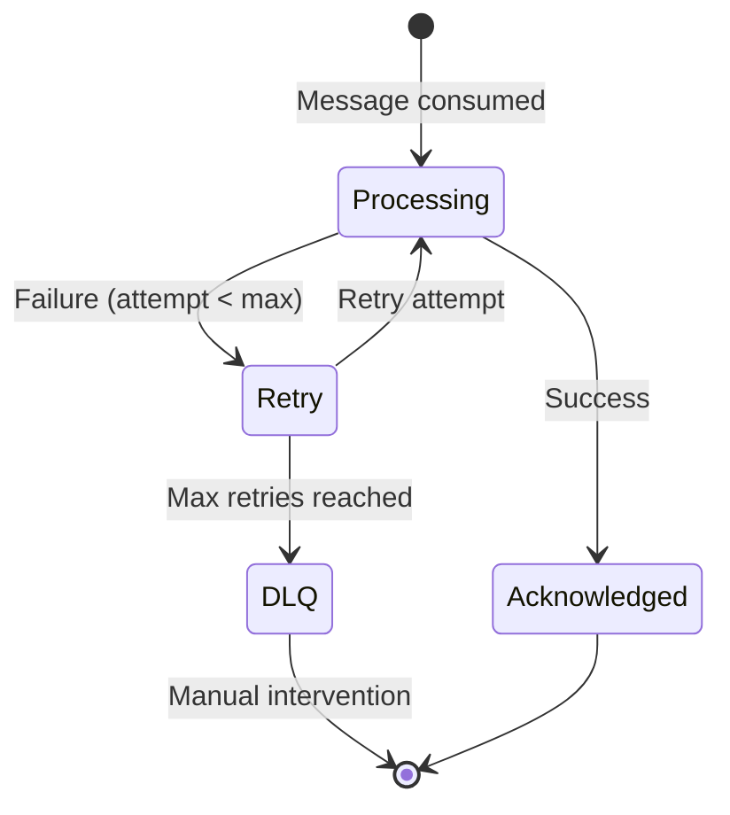

# Dead Letter Queue

Handle messages that fail after maximum retries.

## What is a DLQ?

A **Dead Letter Queue** (DLQ) is a separate stream where failed messages are moved after exhausting all retry attempts.



## Enable DLQ

```typescript
new StreamsPlugin({
  dlq: {
    enabled: true,
    streamSuffix: ':dlq',
    maxLen: 10000,
  },
  consumer: {
    maxRetries: 3,  // Try 3 times before DLQ
  },
})
```

## How It Works

### Automatic DLQ

When max retries reached, message automatically moves to DLQ:

```typescript
@StreamConsumer({
  stream: 'orders',
  group: 'processors',
  maxRetries: 3,  // After 3 failures → DLQ
})
async handle(message: IStreamMessage<Order>): Promise<void> {
  try {
    await this.processOrder(message.data);
    await message.ack();
  } catch (error) {
    // Will retry up to 3 times, then DLQ
    await message.reject(error);
  }
}
```

**Flow:**

```
Attempt 1: Fail → Retry
Attempt 2: Fail → Retry
Attempt 3: Fail → Retry
Attempt 4: Fail → Move to orders:dlq
```

### DLQ Stream Name

DLQ stream = original stream + suffix:

```
Stream: orders
DLQ:    orders:dlq

Stream: notifications
DLQ:    notifications:dlq
```

## DLQ Message Format

DLQ messages follow the `DlqMessage<T>` interface:

```typescript
interface DlqMessage<T> {
  id: string;                    // DLQ message ID
  data: T;                       // Original message data
  originalId: string;            // Original stream message ID
  originalStream: string;        // Source stream name
  error: string;                 // Last error message
  failedAt: Date;                // When the message was moved to DLQ
}

// Example:
{
  id: '1706200000000-0',
  data: {
    orderId: 'order-123',
    customerId: 'cust-456',
  },
  originalId: '1706123456789-0',
  originalStream: 'orders',
  error: 'Payment gateway timeout',
  failedAt: new Date('2025-01-28T10:30:00Z'),
}
```

## Monitor DLQ

<<< @/apps/demo/src/plugins/streams/service-dlq-monitor.usage.ts{typescript}

## Read DLQ Messages

### Manual Consumer

Create a consumer to read DLQ:

```typescript
@Injectable()
export class DLQReader {
  constructor(
    @Inject(DEAD_LETTER_SERVICE) private readonly dlq: IDeadLetterService,
  ) {}

  async inspectDLQ(stream: string): Promise<void> {
    const messages = await this.dlq.getMessages(stream);

    messages.forEach(msg => {
      console.log({
        originalStream: msg.originalStream,
        originalId: msg.originalId,
        error: msg.error,
        failedAt: msg.failedAt,
        data: msg.data,
      });
    });
  }
}
```

### Query DLQ via Service

```typescript
import { DEAD_LETTER_SERVICE, IDeadLetterService } from '@nestjs-redisx/streams';

@Injectable()
export class DLQService {
  constructor(
    @Inject(DEAD_LETTER_SERVICE) private readonly dlq: IDeadLetterService,
  ) {}

  async getDLQMessages(stream: string, count: number = 100) {
    return this.dlq.getMessages(stream, count);
  }
}
```

## Requeue and Purge

Move messages from DLQ back to original stream, or clear the DLQ:

<<< @/apps/demo/src/plugins/streams/service-dlq-requeue.usage.ts{typescript}

## DLQ Strategies

### 1. Manual Review

Inspect and manually fix issues:

```typescript
@Get('admin/dlq/:stream')
async getDLQMessages(@Param('stream') stream: string) {
  const messages = await this.dlqService.getDLQMessages(stream);

  return messages.map(msg => ({
    id: msg.originalId,
    error: msg.error,
    failedAt: msg.failedAt,
    data: msg.data,
  }));
}

@Post('admin/dlq/:stream/requeue/:id')
async requeueMessage(
  @Param('stream') stream: string,
  @Param('id') messageId: string,
) {
  await this.dlqRequeue.requeueMessage(messageId, stream);
  return { success: true };
}
```

### 2. Auto-Requeue After Delay

Automatically retry DLQ messages after some time:

<<< @/apps/demo/src/plugins/streams/service-dlq-auto-requeue.usage.ts{typescript}

### 3. Alternative Processing

Read DLQ messages and process differently based on error type:

<<< @/apps/demo/src/plugins/streams/service-dlq-processor.usage.ts{typescript}

## Monitoring

### Prometheus Metrics

<<< @/apps/demo/src/plugins/streams/monitoring-dlq-metrics.usage.ts{typescript}

### Grafana Dashboard

```yaml
# DLQ message rate
rate(redisx_stream_dlq_total[5m])

# Current DLQ size
redisx_stream_dlq_size

# Alert: High DLQ size
redisx_stream_dlq_size > 100
```

## Best Practices

**1. Keep DLQ size bounded:**

```typescript
dlq: {
  maxLen: 10000,  // Trim old DLQ messages
}
```

**2. Monitor DLQ growth:**

```typescript
@Cron('*/5 * * * *')
async alertOnDLQ() {
  const size = await this.getDLQCount('orders');
  if (size > threshold) {
    await this.alert('DLQ growing');
  }
}
```

**3. Review DLQ regularly:**

Schedule manual review of DLQ messages to fix recurring issues.

**4. Log DLQ moves:**

```typescript
async moveToDLQ(message: any, error: Error) {
  this.logger.error({
    message: 'Message moved to DLQ',
    stream: message.stream,
    messageId: message.id,
    error: error.message,
    data: message.data,
  });
}
```

## Next Steps

- [Message Handling](./message-handling) — ACK/NACK details
- [Monitoring](./monitoring) — Track DLQ metrics
