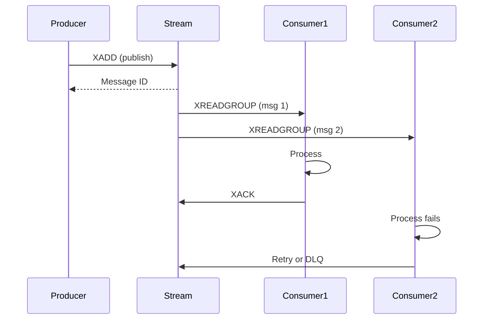

# Streams Plugin

Event streaming solution built on Redis Streams with consumer groups, dead letter queues, and automatic retry handling.

## Overview

The Streams Plugin provides Redis Streams support for NestJS, enabling event-driven architectures, background job processing, and data pipelines.

| Capability | Description |
|------------|-------------|
| Durable Messaging | Messages persist in Redis until acknowledged |
| Consumer Groups | Distribute workload across multiple consumers |
| At-Least-Once Delivery | Explicit acknowledgment ensures processing |
| Message History | Read historical messages from any point |
| Dead Letter Queue | Isolate failed messages for analysis |
| Auto-Claiming | Recover from consumer failures |

## Key Features

- **Producer API** — Publish single or batch messages
- **Consumer Groups** — Load-balanced message distribution with pending message tracking
- **Declarative Consumers** — `@StreamConsumer` decorator for consumer definitions
- **Automatic Retry** — Configurable exponential backoff for failed messages
- **Dead Letter Queue** — Failed messages isolated after max retries
- **Backpressure Handling** — Configurable concurrency and batch sizes

## Installation

::: code-group

```bash [ioredis]
npm install @nestjs-redisx/core @nestjs-redisx/streams ioredis
```

```bash [node-redis]
npm install @nestjs-redisx/core @nestjs-redisx/streams redis
```

:::

## Basic Configuration

<<< @/apps/demo/src/plugins/streams/basic-config.setup.ts{typescript}

## Publishing Messages

<<< @/apps/demo/src/plugins/streams/service-publish.usage.ts{typescript}

## Consuming Messages

<<< @/apps/demo/src/plugins/streams/service-consume.usage.ts{typescript}

## Message Flow



## Common Use Cases

| Use Case | Description |
|----------|-------------|
| Event Sourcing | Persist domain events in order |
| Task Queue | Distribute background jobs |
| Audit Log | Record system actions |
| Notifications | Fan-out to multiple services |
| Analytics | Event processing |
| Webhooks | Delivery with retry |
| Order Processing | Multi-step workflows |

## Documentation

| Topic | Description |
|-------|-------------|
| [Core Concepts](./concepts) | Understanding Redis Streams |
| [Configuration](./configuration) | Configuration reference |
| [Producer API](./producer) | Publishing messages |
| [Consumer API](./consumer) | Consuming messages |
| [Consumer Groups](./consumer-groups) | Load balancing consumers |
| [Dead Letter Queue](./dead-letter-queue) | Handling failed messages |
| [Message Handling](./message-handling) | Ack, reject, retry patterns |
| [Backpressure](./backpressure) | Managing throughput |
| [Patterns](./patterns) | Architecture patterns |
| [Monitoring](./monitoring) | Metrics and observability |
| [Testing](./testing) | Testing stream processors |
| [Recipes](./recipes) | Implementation examples |
| [Troubleshooting](./troubleshooting) | Debugging common issues |
