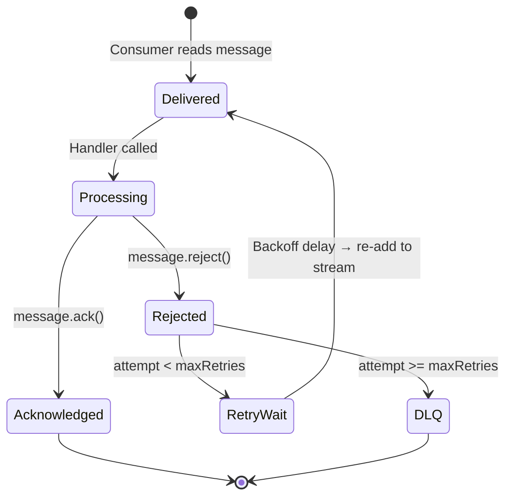

# Message Handling

Handle message acknowledgment, retries, and errors.

## Message Lifecycle



## Acknowledgment (ACK)

Acknowledge successful processing:

```typescript
@StreamConsumer({ stream: 'orders', group: 'processors' })
async handle(message: IStreamMessage<Order>): Promise<void> {
  // Process the message
  await this.orderService.process(message.data);

  // Acknowledge success
  await message.ack();
  // Message removed from pending list
}
```

### What ACK Does

1. Removes message from PEL (Pending Entry List)
2. Message won't be re-delivered
3. Other consumers can process next messages

### Always ACK or Reject

Every message should be explicitly acknowledged or rejected:

```typescript
@StreamConsumer({ stream: 'orders', group: 'processors' })
async handle(message: IStreamMessage<Order>): Promise<void> {
  try {
    await this.orderService.process(message.data);
    await message.ack();   // Always ACK on success
  } catch (error) {
    await message.reject(error);  // Reject for retry/DLQ
  }
}
```

## Rejection (NACK)

Reject failed processing for retry:

```typescript
@StreamConsumer({ stream: 'orders', group: 'processors', maxRetries: 3 })
async handle(message: IStreamMessage<Order>): Promise<void> {
  try {
    await this.orderService.process(message.data);
    await message.ack();
  } catch (error) {
    // Will retry (up to 3 times total)
    await message.reject(error);
  }
}
```

### What Reject Does

1. If `attempt >= maxRetries` — moves message to DLQ and ACKs the original
2. If `attempt < maxRetries` — waits for exponential backoff delay, then ACKs the original and re-adds the message to the stream with `_attempt` incremented
3. The re-added message gets a new ID and is delivered to the next available consumer in the group

## Retry Logic

### Re-delivery with Exponential Backoff

When a message fails processing, it is re-added to the stream as a new entry with an incremented `_attempt` field. Before re-adding, the consumer waits for an exponential backoff delay:

1. Message fails → original is ACKed (removed from PEL)
2. Consumer waits: `delay = min(initialDelay × multiplier^(attempt-1), maxDelay)`
3. Message is re-added to the stream via `XADD` with `_attempt` incremented
4. Any consumer in the group picks up the re-added message
5. After `maxRetries` failures → moved to DLQ

```typescript
new StreamsPlugin({
  consumer: {
    maxRetries: 3,              // Max attempts before DLQ
  },
  retry: {
    initialDelay: 1000,         // First retry delay: 1s
    maxDelay: 30000,            // Cap at 30s
    multiplier: 2,              // Double each attempt
  },
})
```

With defaults (`initialDelay: 1000`, `multiplier: 2`, `maxDelay: 30000`):
- Attempt 1 fails → wait **1s** → re-add as attempt 2
- Attempt 2 fails → wait **2s** → re-add as attempt 3
- Attempt 3 fails → wait **4s** → re-add as attempt 4
- ...and so on, capped at **30s**

::: tip
`claimIdle()` is a separate mechanism for recovering **orphaned** messages — messages stuck in the PEL because the original consumer crashed before ACK. See [Consumer Groups — Claiming Idle Messages](./consumer-groups#claiming-idle-messages).
:::

## Attempt Tracking

Track retry attempts:

```typescript
@StreamConsumer({ stream: 'orders', group: 'processors', maxRetries: 5 })
async handle(message: IStreamMessage<Order>): Promise<void> {
  console.log(`Attempt ${message.attempt} of 5`);

  try {
    await this.orderService.process(message.data);
    await message.ack();
  } catch (error) {
    if (message.attempt >= 5) {
      console.error('Final attempt failed, moving to DLQ');
    } else {
      console.warn(`Attempt ${message.attempt} failed, will retry`);
    }
    await message.reject(error);
  }
}
```

## Conditional Retry

Retry only for transient errors:

```typescript
@StreamConsumer({ stream: 'orders', group: 'processors', maxRetries: 3 })
async handle(message: IStreamMessage<Order>): Promise<void> {
  try {
    await this.orderService.process(message.data);
    await message.ack();
  } catch (error) {
    if (this.isTransientError(error)) {
      // Transient error - retry
      console.log('Transient error, will retry');
      await message.reject(error);
    } else {
      // Permanent error - skip retries, go to DLQ immediately
      console.error('Permanent error, moving to DLQ');
      // Force max retries to move to DLQ
      await message.reject(error);
    }
  }
}

private isTransientError(error: Error): boolean {
  return error.message.includes('timeout') ||
         error.message.includes('ECONNREFUSED') ||
         error.message.includes('503');
}
```

## Idempotency

Ensure handlers are idempotent:

### Using Message ID

```typescript
@StreamConsumer({ stream: 'orders', group: 'processors' })
async handle(message: IStreamMessage<Order>): Promise<void> {
  // Use message ID as idempotency key
  const processed = await this.cache.get(`processed:${message.id}`);

  if (processed) {
    console.log('Already processed, skipping');
    await message.ack();
    return;
  }

  // Process
  await this.orderService.process(message.data);

  // Mark as processed
  await this.cache.set(`processed:${message.id}`, true, { ttl: 86400 });

  await message.ack();
}
```

### Using Business ID

```typescript
@StreamConsumer({ stream: 'orders', group: 'processors' })
async handle(message: IStreamMessage<Order>): Promise<void> {
  const orderId = message.data.orderId;

  // Check if already processed
  const order = await this.orderRepo.findOne(orderId);

  if (order?.processed) {
    console.log(`Order ${orderId} already processed`);
    await message.ack();
    return;
  }

  // Process
  await this.orderService.process(message.data);

  // Mark as processed
  await this.orderRepo.update(orderId, { processed: true });

  await message.ack();
}
```

## Error Handling

### Graceful Error Handling

```typescript
@StreamConsumer({ stream: 'orders', group: 'processors' })
async handle(message: IStreamMessage<Order>): Promise<void> {
  try {
    await this.processOrder(message.data);
    await message.ack();
  } catch (error) {
    // Log error with context
    this.logger.error({
      message: 'Order processing failed',
      orderId: message.data.orderId,
      messageId: message.id,
      attempt: message.attempt,
      error: error.message,
      stack: error.stack,
    });

    // Reject for retry
    await message.reject(error);
  }
}
```

### Error Types

```typescript
@StreamConsumer({ stream: 'orders', group: 'processors' })
async handle(message: IStreamMessage<Order>): Promise<void> {
  try {
    await this.processOrder(message.data);
    await message.ack();
  } catch (error) {
    if (error instanceof ValidationError) {
      // Validation error - don't retry
      this.logger.error('Validation failed:', error);
      await message.ack();  // ACK to prevent retry, log for investigation
    } else if (error instanceof NetworkError) {
      // Network error - retry
      this.logger.warn('Network error, will retry');
      await message.reject(error);
    } else {
      // Unknown error - log and retry
      this.logger.error('Unknown error:', error);
      await message.reject(error);
    }
  }
}
```

### Circuit Breaker

Prevent cascading failures (using any circuit breaker library):

```typescript
@Injectable()
export class OrderProcessor {
  // Example: implement or use a circuit breaker library
  private circuitBreaker = new CircuitBreaker({
    failureThreshold: 5,
    timeout: 10000,
    resetTimeout: 60000,
  });

  @StreamConsumer({ stream: 'orders', group: 'processors' })
  async handle(message: IStreamMessage<Order>): Promise<void> {
    try {
      // Use circuit breaker
      await this.circuitBreaker.execute(() =>
        this.orderService.process(message.data)
      );

      await message.ack();
    } catch (error) {
      if (this.circuitBreaker.isOpen()) {
        // Circuit open - don't retry immediately
        this.logger.warn('Circuit breaker open, delaying retry');
        await new Promise(resolve => setTimeout(resolve, 60000));
      }

      await message.reject(error);
    }
  }
}
```

## Timeout Handling

Set processing timeout:

```typescript
@StreamConsumer({ stream: 'orders', group: 'processors' })
async handle(message: IStreamMessage<Order>): Promise<void> {
  try {
    // Set timeout for processing
    await Promise.race([
      this.processOrder(message.data),
      this.timeout(30000),  // 30 second timeout
    ]);

    await message.ack();
  } catch (error) {
    if (error.message === 'Timeout') {
      this.logger.warn(`Processing timeout for message ${message.id}`);
    }
    await message.reject(error);
  }
}

private timeout(ms: number): Promise<never> {
  return new Promise((_, reject) =>
    setTimeout(() => reject(new Error('Timeout')), ms)
  );
}
```

## Partial Processing

Handle batch operations:

```typescript
@StreamConsumer({ stream: 'notifications', group: 'senders' })
async handle(message: IStreamMessage<Notification[]>): Promise<void> {
  const notifications = message.data;
  const errors = [];

  for (const notification of notifications) {
    try {
      await this.send(notification);
    } catch (error) {
      errors.push({ notification, error });
    }
  }

  if (errors.length === 0) {
    // All succeeded
    await message.ack();
  } else if (errors.length < notifications.length) {
    // Partial success - log and ACK
    this.logger.warn(`Partial success: ${errors.length} failed`);
    // Could republish failed items to stream
    await message.ack();
  } else {
    // All failed - retry
    await message.reject(new Error('All notifications failed'));
  }
}
```

## Best Practices

**1. Always ACK or Reject:**

```typescript
// ✅ Good - explicit handling
try {
  await process();
  await message.ack();
} catch (error) {
  await message.reject(error);
}

// ❌ Bad - no ACK/reject, message stuck in pending list
await process();  // What if this fails?
```

**2. Make handlers idempotent:**

```typescript
// ✅ Good - check if already processed
if (await this.isProcessed(message.id)) {
  await message.ack();
  return;
}
```

**3. Log errors with context:**

```typescript
// ✅ Good - full context
this.logger.error({
  message: 'Processing failed',
  messageId: message.id,
  attempt: message.attempt,
  data: message.data,
  error: error.message,
});
```

**4. Set appropriate max retries:**

```typescript
// Fast operations
maxRetries: 3

// Expensive operations
maxRetries: 5

// Critical operations
maxRetries: 10
```

## Next Steps

- [Dead Letter Queue](./dead-letter-queue) — Handle failed messages
- [Backpressure](./backpressure) — Control processing rate
