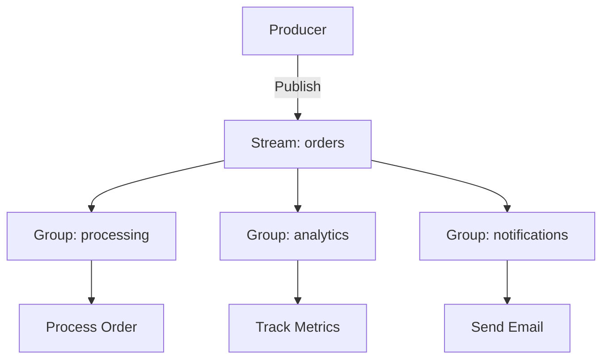
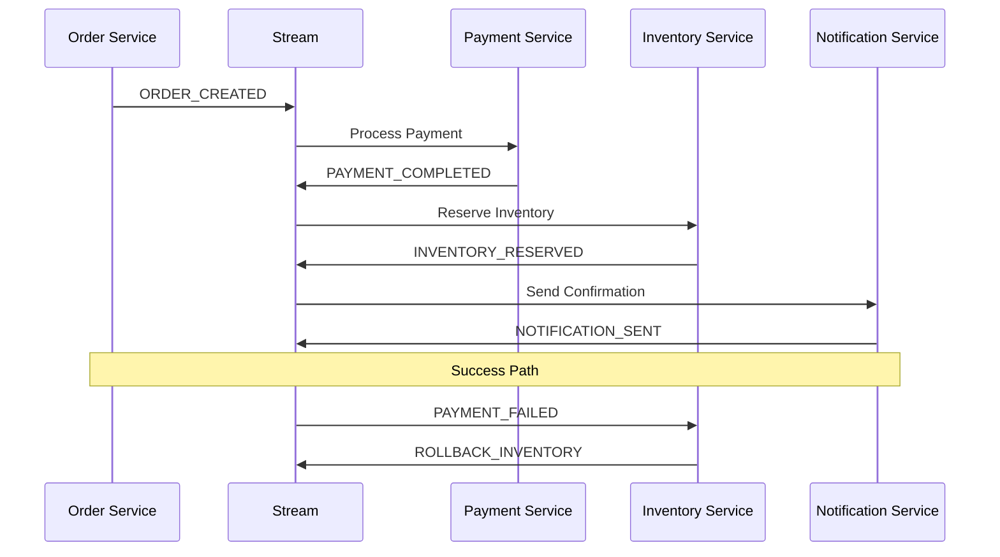

# Patterns

Common architectural patterns with Redis Streams.

## Fan-out Pattern

Distribute same message to multiple consumers.



### Implementation

```typescript
// Producer
@Injectable()
export class OrderService {
  async createOrder(dto: CreateOrderDto): Promise<Order> {
    const order = await this.orderRepo.create(dto);

    // Publish once
    await this.producer.publish('orders', {
      type: 'ORDER_CREATED',
      orderId: order.id,
      customerId: order.customerId,
      total: order.total,
    });

    return order;
  }
}

// Consumer 1: Processing
@StreamConsumer({ stream: 'orders', group: 'processing' })
async processOrder(message: IStreamMessage<OrderEvent>) {
  await this.fulfillmentService.fulfill(message.data);
  await message.ack();
}

// Consumer 2: Analytics
@StreamConsumer({ stream: 'orders', group: 'analytics' })
async trackMetrics(message: IStreamMessage<OrderEvent>) {
  await this.analytics.track(message.data);
  await message.ack();
}

// Consumer 3: Notifications
@StreamConsumer({ stream: 'orders', group: 'notifications' })
async sendNotification(message: IStreamMessage<OrderEvent>) {
  await this.emailService.sendConfirmation(message.data);
  await message.ack();
}
```

## Priority Queue

Process high-priority messages first.

```typescript
// Publish with priority
await this.producer.publish('tasks', {
  id: 'task-1',
  priority: 'high',
  data: {...},
});

await this.producer.publish('tasks', {
  id: 'task-2',
  priority: 'low',
  data: {...},
});

// Separate streams by priority
await this.producer.publish('tasks:high', highPriorityTask);
await this.producer.publish('tasks:low', lowPriorityTask);
```

### Multiple Streams by Priority

<<< @/apps/demo/src/plugins/streams/pattern-priority.usage.ts{typescript}

## Saga Pattern

Orchestrate multi-step distributed transactions.



### Implementation

<<< @/apps/demo/src/plugins/streams/pattern-saga.usage.ts{typescript}

## Event Sourcing

Store all state changes as events.

```typescript
// Aggregate Root
export class Order {
  private events: OrderEvent[] = [];

  create(dto: CreateOrderDto) {
    this.apply(new OrderCreatedEvent(dto));
  }

  confirm() {
    this.apply(new OrderConfirmedEvent(this.id));
  }

  cancel() {
    this.apply(new OrderCancelledEvent(this.id));
  }

  private apply(event: OrderEvent) {
    this.events.push(event);
    // Apply state change
    this.applyEvent(event);
  }

  getUncommittedEvents(): OrderEvent[] {
    return this.events;
  }
}

// Event Store
@Injectable()
export class OrderEventStore {
  async save(order: Order): Promise<void> {
    const events = order.getUncommittedEvents();

    for (const event of events) {
      await this.producer.publish('orders', event);
    }
  }

  async load(orderId: string): Promise<Order> {
    const order = new Order();

    // Read all events for this order
    const events = await this.getEventsForOrder(orderId);

    for (const event of events) {
      order.applyEvent(event);
    }

    return order;
  }

  private async getEventsForOrder(orderId: string): Promise<OrderEvent[]> {
    // Read from stream start
    const info = await this.producer.getStreamInfo('orders');

    // Fetch all messages and filter by orderId
    // In production, use secondary index or separate streams per aggregate
    return events;
  }
}

// Projection
@StreamConsumer({ stream: 'orders', group: 'order-projection' })
async projectOrder(message: IStreamMessage<OrderEvent>) {
  const event = message.data;

  switch (event.type) {
    case 'ORDER_CREATED':
      await this.orderView.create(event.data);
      break;
    case 'ORDER_CONFIRMED':
      await this.orderView.update(event.data.orderId, { status: 'confirmed' });
      break;
    case 'ORDER_CANCELLED':
      await this.orderView.update(event.data.orderId, { status: 'cancelled' });
      break;
  }

  await message.ack();
}
```

## CQRS (Command Query Responsibility Segregation)

Separate read and write models.

```typescript
// Command Side (Write)
@Injectable()
export class OrderCommandHandler {
  async createOrder(command: CreateOrderCommand): Promise<void> {
    // Validate command
    await this.validator.validate(command);

    // Create order
    const order = await this.orderRepo.create(command);

    // Publish event
    await this.producer.publish('orders', {
      type: 'ORDER_CREATED',
      orderId: order.id,
      data: order,
    });
  }
}

// Query Side (Read)
@Injectable()
export class OrderQueryHandler {
  async getOrder(orderId: string): Promise<OrderView> {
    // Read from optimized read model
    return await this.orderViewRepo.findOne(orderId);
  }

  async listOrders(filter: OrderFilter): Promise<OrderView[]> {
    // Query from denormalized view
    return await this.orderViewRepo.find(filter);
  }
}

// Read Model Projector
@StreamConsumer({ stream: 'orders', group: 'read-model' })
async updateReadModel(message: IStreamMessage<OrderEvent>) {
  const event = message.data;

  // Update denormalized read model
  await this.orderViewRepo.upsert({
    id: event.orderId,
    ...event.data,
    lastUpdated: new Date(),
  });

  await message.ack();
}
```

## Outbox Pattern

Ensure reliable event publishing with database transactions.

<<< @/apps/demo/src/plugins/streams/pattern-outbox.usage.ts{typescript}

## Work Queue Pattern

Distribute work items to workers.

<<< @/apps/demo/src/plugins/streams/pattern-work-queue.usage.ts{typescript}

## Next Steps

- [Monitoring](./monitoring) — Track streaming metrics
- [Recipes](./recipes) — Real-world examples
