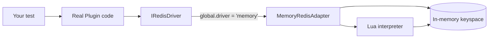

# Testing Utilities

An in-memory Redis driver for unit-testing NestJS RedisX code — **no Redis required**.

## Overview

`@nestjs-redisx/testing` provides a drop-in `'memory'` driver that implements the
same `IRedisDriver` contract as the ioredis and node-redis adapters. Your plugins
(`CachePlugin`, `LocksPlugin`, `RateLimitPlugin`, `IdempotencyPlugin`, `StreamsPlugin`)
run with their **real production code** — including their Lua scripts and stream
consumer groups — against an in-memory keyspace. Tests stay fast, deterministic,
and isolated.

| Concern | Real Redis in tests | `@nestjs-redisx/testing` |
|---------|---------------------|--------------------------|
| Infrastructure | Container / service required | None — pure in-memory |
| Speed | Network round-trips | Synchronous, microsecond |
| Isolation | Shared keyspace, flush needed | Fresh keyspace per driver |
| Lua scripts | Run on Redis | Run on a built-in interpreter |
| Determinism | Time/ordering quirks | Fully controllable |

## Key Features

- **Real plugin behavior** — exercises the actual cache/locks/rate-limit/idempotency/streams code paths, not mocks.
- **Lua execution** — a small, in-house Lua interpreter runs the plugins' atomic scripts (token bucket, lock release, etc.).
- **Zero dependencies** — no third-party Redis mock; nothing extra in your runtime.
- **Same `IRedisDriver`** — strings, hashes, sets, sorted sets, lists, keys/TTL, and scripting.
- **Drop-in** — switch the driver with one option, or use the `RedisTestingModule` wrapper.

## Installation

```bash
npm install -D @nestjs-redisx/testing
```

It is a `devDependency` — the in-memory driver is only for tests.

## Quick Start

Use the `RedisTestingModule` wrapper to force the in-memory driver and register
the same plugins you use in production:

<<< @/apps/demo/src/plugins/testing/redis-testing-module.setup.ts{typescript}

Then boot a Nest context and assert on the **real** service behavior:

<<< @/apps/demo/src/plugins/testing/bootstrap-and-assert.usage.ts{typescript}

## How It Works



The plugins are **driver-agnostic** — they only depend on `IRedisDriver`. Selecting
the `'memory'` driver swaps the transport; everything above it is unchanged.

## Documentation

| Topic | Description |
|-------|-------------|
| [Configuration](./configuration) | Driver selection, `RedisTestingModule`, and options |
| [In-Memory Driver](./memory-driver) | Supported commands, the Lua subset, and limitations |
| [Testing Plugins](./testing-plugins) | Patterns for cache, locks, rate-limit, idempotency |
| [Troubleshooting](./troubleshooting) | Common errors and how to resolve them |
