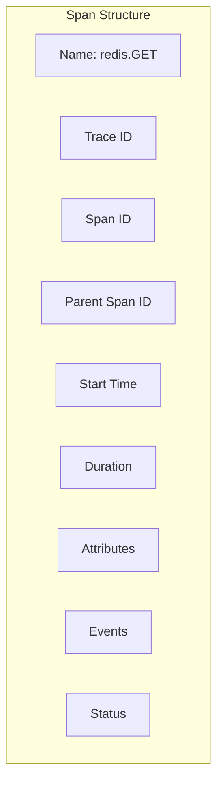
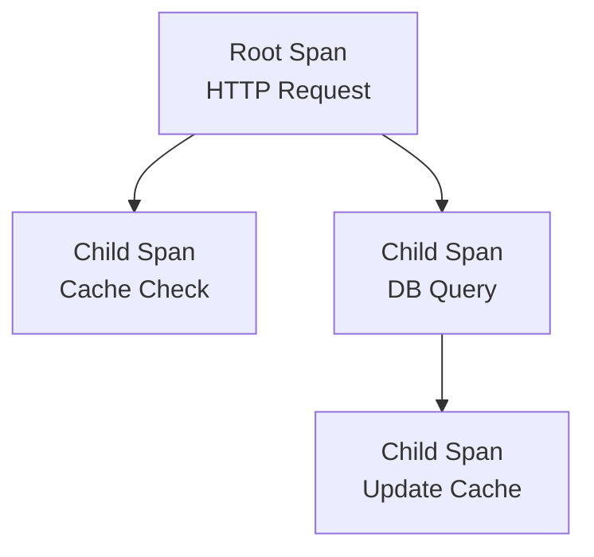
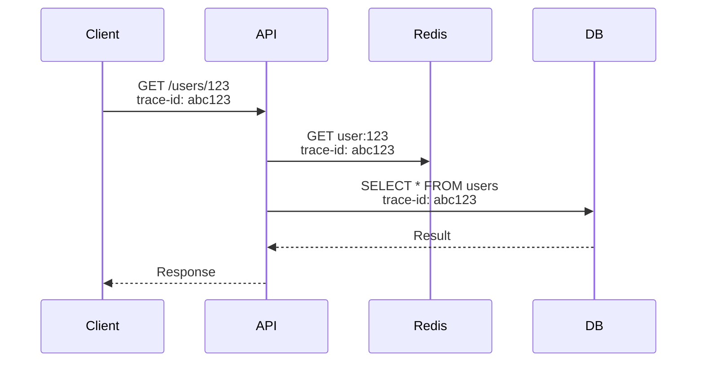

# Core Concepts

Understand distributed tracing with OpenTelemetry.

## Traces

A **trace** represents the complete journey of a request through your system.

```
Trace ID: abc123

├── Span 1: HTTP GET /api/users/123 (50ms)
├── Span 2: redis.GET user:123 (1ms)
├── Span 3: database.query (35ms)
└── Span 4: redis.SET user:123 (2ms)
```

**Properties:**
- **Trace ID**: Unique identifier for the entire request
- **Duration**: Total time from start to finish
- **Spans**: Individual operations within the trace

## Spans

A **span** represents a single operation within a trace.



### Span Properties

```typescript
{
  name: 'redis.GET',
  traceId: 'abc123...',
  spanId: 'def456...',
  parentSpanId: 'ghi789...',
  startTime: 1706123456789,
  duration: 1234567,  // nanoseconds
  attributes: {
    'db.system': 'redis',
    'db.operation': 'GET',
    'db.redis.key': 'user:123',
  },
  events: [
    { time: 1706123456790, name: 'cache.miss' }
  ],
  status: { code: 'OK' }
}
```

## Span Hierarchy

Spans form a parent-child relationship:



### Parent-Child Relationship

```typescript
// Parent span
const parentSpan = tracer.startSpan('http.request');

// Child span
const childSpan = tracer.startSpan('redis.GET', {
  parent: parentSpan,  // Links to parent
});

childSpan.end();
parentSpan.end();
```

## Context Propagation

Context carries trace information across service boundaries.

### Within Same Process

```typescript
// Automatic propagation
@Get('/users/:id')
async getUser(@Param('id') id: string) {
  // HTTP span automatically created
  const user = await this.cache.get(`user:${id}`);
  // ↑ Redis span inherits HTTP span's context
  return user;
}
```

### Across Services



**HTTP Headers:**

```
traceparent: 00-abc123-def456-01
tracestate: redisx=123
```

## Attributes

Metadata attached to spans.

### Semantic Conventions

OpenTelemetry defines standard attributes:

```typescript
// Database attributes
{
  'db.system': 'redis',
  'db.operation': 'GET',
  'db.statement': 'GET user:123',
  'db.connection_string': 'redis://localhost:6379',
}

// HTTP attributes
{
  'http.method': 'GET',
  'http.target': '/api/users/123',
  'http.status_code': 200,
}
```

### Custom Attributes

```typescript
span.setAttribute('user.id', '123');
span.setAttribute('user.role', 'admin');
span.setAttribute('cache.hit', false);
```

## Events

Point-in-time occurrences within a span.

```typescript
// Record an event
span.addEvent('cache.miss', {
  'cache.key': 'user:123',
  'cache.namespace': 'users',
});

// Event with attributes
span.addEvent('query.slow', {
  'query.duration_ms': 150,
});
```

**Example Timeline:**

```
Span: redis.GET user:123 (10ms)
├── t=0ms:  Start
├── t=2ms:  Event: cache.lookup
├── t=5ms:  Event: cache.miss
├── t=8ms:  Event: db.query
└── t=10ms: End
```

## Status

Indicates span success or failure.

```typescript
// Success
span.setStatus('OK');

// Error
span.setStatus('ERROR');
```

## Sampling

Decide which traces to collect.

### Always Sample

```typescript
{
  sampling: {
    strategy: 'always',
  }
}
```

**Result:** All traces collected (100%)

### Ratio-Based Sampling

```typescript
{
  sampling: {
    strategy: 'ratio',
    ratio: 0.1,  // 10%
  }
}
```

**Result:** 1 in 10 traces collected

### Parent-Based Sampling

```typescript
{
  sampling: {
    strategy: 'parent',
  }
}
```

**Result:** Follow parent span's sampling decision

## Trace Visualization

```mermaid
gantt
    title Request Trace Timeline
    dateFormat x
    axisFormat %L ms

    section HTTP
    Request :0, 50

    section Cache
    GET user:123 :5, 6

    section Database
    Query users :10, 45

    section Cache
    SET user:123 :46, 48
```

## Best Practices

**1. Use semantic attribute names:**

```typescript
// ✅ Good - Standard names
{
  'db.system': 'redis',
  'db.operation': 'GET',
}

// ❌ Bad - Custom names
{
  'database': 'redis',
  'command': 'GET',
}
```

**2. Keep spans focused:**

```typescript
// ✅ Good - One operation per span
const span = tracer.startSpan('redis.GET');
await redis.get(key);
span.end();

// ❌ Bad - Multiple operations in one span
const span = tracer.startSpan('cache.operation');
await redis.get(key1);
await redis.get(key2);
await redis.set(key3, value);
span.end();
```

**3. Always end spans:**

```typescript
// ✅ Good - Guaranteed cleanup
const span = tracer.startSpan('operation');
try {
  await doWork();
} finally {
  span.end();
}

// ❌ Bad - Span might leak
const span = tracer.startSpan('operation');
await doWork();
span.end();  // Skipped if error thrown!
```

**4. Use appropriate sampling:**

```typescript
// Production
sampling: { strategy: 'ratio', ratio: 0.01 }  // 1%

// Development
sampling: { strategy: 'always' }
```

## Next Steps

- [Configuration](./configuration) — Configure tracing
- [Spans](./spans) — Create custom spans
- [OpenTelemetry](./opentelemetry) — OTel integration
