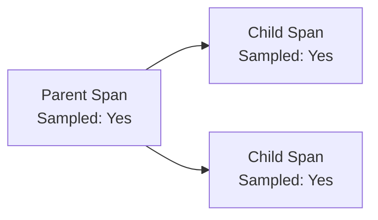

# Configuration

Complete configuration reference for the Tracing Plugin.

## Basic Configuration

<<< @/apps/demo/src/plugins/tracing/basic-config.setup.ts{typescript}

## Configuration Options

### ITracingPluginOptions

```typescript
interface ITracingPluginOptions {
  // Enable/disable tracing
  enabled?: boolean;                    // @default true

  // Service identification
  serviceName?: string;                 // @default 'nestjs-redisx'

  // Exporter configuration
  exporter?: {
    type?: 'otlp' | 'jaeger' | 'zipkin' | 'console';  // @default 'otlp'
    endpoint?: string;
    headers?: Record<string, string>;
  };

  // Sampling strategy
  sampling?: {
    strategy?: 'always' | 'never' | 'ratio' | 'parent';  // @default 'always'
    ratio?: number;                                         // @default 1.0
  };

  // Resource attributes added to all spans
  resourceAttributes?: Record<string, string | number | boolean>;

  // Span options
  spans?: {
    includeArgs?: boolean;       // @default false (security)
    includeResult?: boolean;     // @default false
    maxArgLength?: number;       // @default 100
    excludeCommands?: string[];  // Commands to exclude from tracing
  };

  // Pre-check sampling rate (0-1), applied before OTel SDK sampler
  sampleRate?: number;             // @default 1.0

  // Enable/disable features
  traceRedisCommands?: boolean;  // @default true (requires @opentelemetry/instrumentation-ioredis)
  traceHttpRequests?: boolean;   // @default true (requires @opentelemetry/instrumentation-http)
  pluginTracing?: boolean;       // @default true
}
```

## Service Identification

### Service Name

Identifies your service in trace visualizations. Defaults to `'nestjs-redisx'` if not specified.

```typescript
new TracingPlugin({
  serviceName: 'user-service',
})
```

## Exporter Configuration

### OTLP Exporter

OpenTelemetry Protocol - recommended for production.

```typescript
{
  exporter: {
    type: 'otlp',
    endpoint: 'http://jaeger:4318',
    headers: {
      'x-api-key': process.env.TRACING_API_KEY,
    },
  }
}
```

### Jaeger Exporter

Export to Jaeger via OTLP protocol. Internally uses the same OTLP exporter — just point to your Jaeger OTLP endpoint.

```typescript
{
  exporter: {
    type: 'jaeger',
    endpoint: 'http://jaeger:4318/v1/traces',
  }
}
```

### Zipkin Exporter

Export to Zipkin-compatible backends via OTLP. Internally uses the same OTLP exporter.

```typescript
{
  exporter: {
    type: 'zipkin',
    endpoint: 'http://zipkin:9411/api/v2/spans',
  }
}
```

### Console Exporter

Development debugging - prints to console.

```typescript
{
  exporter: {
    type: 'console',
  }
}
```

**Output:**

```json
{
  "traceId": "abc123...",
  "name": "redis.GET",
  "timestamp": 1706123456789,
  "duration": 1234567,
  "attributes": {
    "db.system": "redis",
    "db.operation": "GET"
  }
}
```

## Sampling Configuration

### Always Sample

Collect all traces (100%).

```typescript
{
  sampling: {
    strategy: 'always',
  }
}
```

**Use case:** Development, debugging

### Never Sample

Collect no traces (0%).

```typescript
{
  sampling: {
    strategy: 'never',
  }
}
```

**Use case:** Disable tracing temporarily

### Ratio-Based Sampling

Collect a percentage of traces.

```typescript
{
  sampling: {
    strategy: 'ratio',
    ratio: 0.1,  // 10% of traces
  }
}
```

**Use case:** Production with high traffic

```typescript
// Environment-based sampling
{
  sampling: {
    strategy: 'ratio',
    ratio: process.env.NODE_ENV === 'production' ? 0.01 : 1.0,
  }
}
```

### Parent-Based Sampling

Follow parent span's sampling decision.

```typescript
{
  sampling: {
    strategy: 'parent',
  }
}
```

**How it works:**



**Use case:** Microservices - maintain consistent sampling across services

## Resource Attributes

Add custom attributes to all spans.

```typescript
{
  resourceAttributes: {
    'deployment.environment': 'production',
    'service.instance.id': process.env.HOSTNAME,
    'cloud.provider': 'aws',
    'cloud.region': 'us-east-1',
  }
}
```

**Common attributes:**

| Attribute | Description | Example |
|-----------|-------------|---------|
| `deployment.environment` | Environment name | `production` |
| `service.instance.id` | Instance identifier | `pod-abc-123` |
| `host.name` | Hostname | `ip-10-0-1-42` |
| `cloud.provider` | Cloud provider | `aws`, `gcp`, `azure` |
| `cloud.region` | Cloud region | `us-east-1` |

## Feature Toggles

### Enable/Disable Tracing

```typescript
{
  enabled: process.env.TRACING_ENABLED === 'true',
}
```

### Trace Redis Commands

```typescript
{
  traceRedisCommands: true,  // Create spans for redis.GET, redis.SET, etc.
}
```

::: warning External Dependency
`traceRedisCommands` and `traceHttpRequests` require installing the corresponding OpenTelemetry instrumentation packages (`@opentelemetry/instrumentation-ioredis`, `@opentelemetry/instrumentation-http`). The plugin will log a warning at startup if these packages are not installed.
:::

### Trace Plugin Operations

```typescript
{
  pluginTracing: true,  // Create spans for cache.get, lock.acquire, etc.
}
```

## Complete Example

<<< @/apps/demo/src/plugins/tracing/env-config.setup.ts{typescript}

## Environment Variables

```bash
# .env
SERVICE_NAME=user-service
SERVICE_VERSION=1.2.3
ENVIRONMENT=production

OTLP_ENDPOINT=http://jaeger:4318
TRACING_API_KEY=your-api-key

TRACING_ENABLED=true
SAMPLING_RATIO=0.01

AWS_REGION=us-east-1
```

## Multiple Exporters

Export to multiple backends simultaneously.

```typescript
import { BatchSpanProcessor, SimpleSpanProcessor } from '@opentelemetry/sdk-trace-base';
import { OTLPTraceExporter } from '@opentelemetry/exporter-trace-otlp-http';
import { ConsoleSpanExporter } from '@opentelemetry/sdk-trace-base';

// Create custom tracer provider with multiple exporters
const tracerProvider = new NodeTracerProvider({
  resource: new Resource({
    [SemanticResourceAttributes.SERVICE_NAME]: 'my-service',
  }),
});

// OTLP to Jaeger (production)
tracerProvider.addSpanProcessor(
  new BatchSpanProcessor(
    new OTLPTraceExporter({
      url: 'http://jaeger:4318/v1/traces',
    }),
  ),
);

// Console (development)
if (process.env.NODE_ENV === 'development') {
  tracerProvider.addSpanProcessor(
    new SimpleSpanProcessor(new ConsoleSpanExporter()),
  );
}

tracerProvider.register();
```

## Best Practices

**1. Use environment-based configuration**

```typescript
{
  sampling: {
    ratio: process.env.NODE_ENV === 'production' ? 0.01 : 1.0,
  }
}
```

**2. Add meaningful resource attributes**

```typescript
{
  resourceAttributes: {
    'deployment.environment': process.env.ENVIRONMENT,
    'service.instance.id': process.env.HOSTNAME,
  }
}
```

**3. Use OTLP in production**

```typescript
// ✅ Production
exporter: { type: 'otlp', endpoint: 'http://collector:4318' }

// ✅ Development
exporter: { type: 'console' }
```

## Next Steps

- [OpenTelemetry](./opentelemetry) — OTel integration
- [Exporters](./exporters) — Exporter setup
- [Sampling](./sampling) — Sampling strategies
