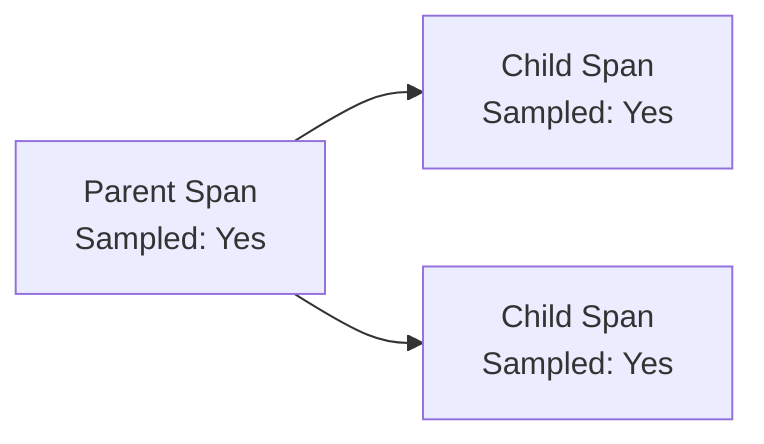

# Configuration

Complete configuration reference for the Tracing Plugin.

## Basic Configuration

<<< @/apps/demo/src/plugins/tracing/basic-config.setup.ts{typescript}

## Configuration Options

### ITracingPluginOptions

```typescript
interface ITracingPluginOptions {
  // Enable/disable tracing
  enabled?: boolean;                    // @default true

  // Tracer provider strategy — see "Provider Modes" below
  provider?: 'auto' | 'external' | 'standalone';  // @default 'auto'

  // Service identification
  serviceName?: string;                 // @default 'nestjs-redisx'

  // Exporter configuration
  exporter?: {
    type?: 'otlp' | 'jaeger' | 'zipkin' | 'console';  // @default 'otlp'
    endpoint?: string;
    headers?: Record<string, string>;
  };

  // Sampling strategy
  sampling?: {
    strategy?: 'always' | 'never' | 'ratio' | 'parent';  // @default 'parent'
    ratio?: number;                                         // @default 1.0
  };

  // Resource attributes added to all spans
  resourceAttributes?: Record<string, string | number | boolean>;

  // Span options
  spans?: {
    includeArgs?: boolean;       // @default false (security)
    includeResult?: boolean;     // @default false
    maxArgLength?: number;       // @default 100
    excludeCommands?: string[];  // Commands to exclude from tracing
  };

  // Pre-check sampling rate (0-1), applied before OTel SDK sampler
  sampleRate?: number;             // @default 1.0

  // Enable/disable features
  traceRedisCommands?: boolean | 'force';  // @default true — native redis.<COMMAND> spans, no extra packages
  traceHttpRequests?: boolean;   // @default true — startup check only, see below
  pluginTracing?: boolean;       // @default true
}
```

## Provider Modes

The `provider` option controls where spans go:

| Mode | Behavior |
|------|----------|
| `'auto'` (default) | Application already registered a global OpenTelemetry tracer provider → use it. No global provider, but the OTel SDK packages are importable → set up an own provider with the configured `exporter`/`sampling`. Neither → silent no-op with one informational log line. |
| `'external'` | Never create a provider. The plugin is a pure `@opentelemetry/api` consumer: spans flow into whatever the application registered, or become no-ops. `exporter` and `sampling` options are unused in this mode. |
| `'standalone'` | Always set up an own provider with the configured exporter. Requires the OpenTelemetry SDK packages; initialization fails with `TracingInitializationError` when they are missing. |

::: tip The plugin never overrides an application provider
In every mode, if a global tracer provider is already registered when the plugin initializes, the plugin uses it and does not touch the global registration. With `provider: 'standalone'` this is additionally logged as a warning, since the requested own provider was not created.
:::

Apps with their own OpenTelemetry bootstrap need no configuration at all — `'auto'` detects the registered provider and RedisX spans join the application's traces, exporter and sampler included. See [OpenTelemetry Integration](/en/reference/tracing/opentelemetry) for bootstrap ordering details.

## Service Identification

### Service Name

Identifies your service in trace visualizations. Defaults to `'nestjs-redisx'` if not specified.

```typescript
new TracingPlugin({
  serviceName: 'user-service',
})
```

## Exporter Configuration

### OTLP Exporter

OpenTelemetry Protocol - recommended for production.

```typescript
{
  exporter: {
    type: 'otlp',
    endpoint: 'http://jaeger:4318',
    headers: {
      'x-api-key': process.env.TRACING_API_KEY,
    },
  }
}
```

### Jaeger Exporter

Export to Jaeger via OTLP protocol. Internally uses the same OTLP exporter — just point to your Jaeger OTLP endpoint.

```typescript
{
  exporter: {
    type: 'jaeger',
    endpoint: 'http://jaeger:4318/v1/traces',
  }
}
```

### Zipkin Exporter

Export to Zipkin-compatible backends via OTLP. Internally uses the same OTLP exporter.

```typescript
{
  exporter: {
    type: 'zipkin',
    endpoint: 'http://zipkin:9411/api/v2/spans',
  }
}
```

### Console Exporter

Development debugging - prints to console.

```typescript
{
  exporter: {
    type: 'console',
  }
}
```

**Output:**

```json
{
  "traceId": "abc123...",
  "name": "redis.GET",
  "timestamp": 1706123456789,
  "duration": 1234567,
  "attributes": {
    "db.system": "redis",
    "db.operation": "GET"
  }
}
```

## Sampling Configuration

### Always Sample

Collect all traces (100%).

```typescript
{
  sampling: {
    strategy: 'always',
  }
}
```

**Use case:** Development, debugging

### Never Sample

Collect no traces (0%).

```typescript
{
  sampling: {
    strategy: 'never',
  }
}
```

**Use case:** Disable tracing temporarily

### Ratio-Based Sampling

Collect a percentage of traces.

```typescript
{
  sampling: {
    strategy: 'ratio',
    ratio: 0.1,  // 10% of traces
  }
}
```

**Use case:** Production with high traffic

```typescript
// Environment-based sampling
{
  sampling: {
    strategy: 'ratio',
    ratio: process.env.NODE_ENV === 'production' ? 0.01 : 1.0,
  }
}
```

### Parent-Based Sampling

Follow parent span's sampling decision.

```typescript
{
  sampling: {
    strategy: 'parent',
  }
}
```

**How it works:**


```mermaid
graph LR
    Parent[Parent Span<br/>Sampled: Yes]
    Child1[Child Span<br/>Sampled: Yes]
    Child2[Child Span<br/>Sampled: Yes]

    Parent --> Child1
    Parent --> Child2
```

**Use case:** Microservices - maintain consistent sampling across services

## Resource Attributes

Add custom attributes to all spans.

```typescript
{
  resourceAttributes: {
    'deployment.environment': 'production',
    'service.instance.id': process.env.HOSTNAME,
    'cloud.provider': 'aws',
    'cloud.region': 'us-east-1',
  }
}
```

**Common attributes:**

| Attribute | Description | Example |
|-----------|-------------|---------|
| `deployment.environment` | Environment name | `production` |
| `service.instance.id` | Instance identifier | `pod-abc-123` |
| `host.name` | Hostname | `ip-10-0-1-42` |
| `cloud.provider` | Cloud provider | `aws`, `gcp`, `azure` |
| `cloud.region` | Cloud region | `us-east-1` |

## Feature Toggles

### Enable/Disable Tracing

```typescript
{
  enabled: process.env.TRACING_ENABLED === 'true',
}
```

### Trace Redis Commands

```typescript
{
  traceRedisCommands: true,  // Create spans for redis.GET, redis.SET, etc.
}
```

Command tracing is **native**: every command executed through RedisX drivers is wrapped in a `redis.<COMMAND>` CLIENT span at the driver layer — no external instrumentation package needed. It covers all named clients and runtime-created connections (e.g. the Pub/Sub subscriber), honors `spans.excludeCommands` / `includeArgs` / `includeResult` / `maxArgLength`, and each span parents onto the active trace context, so Redis commands appear inside the HTTP request trace that triggered them.

::: warning Either the native hook or an OTel instrumentation — not both
If `@opentelemetry/instrumentation-ioredis` (or `instrumentation-redis-4`) is active, both it and the native hook would emit a span per command. The plugin detects an active instrumentation and pauses its hook automatically — the check runs per command, so instrumentation enabled late or disabled at runtime is handled too, with one log line per state change. Pick ONE source of Redis spans: either drop the Redis instrumentation from your OTel bootstrap (the native hook carries the same `db.*` attributes), or set `traceRedisCommands: false`. To deliberately emit both, set `traceRedisCommands: 'force'`.
:::

::: warning traceHttpRequests is a startup check
Incoming-HTTP instrumentation cannot be registered by this plugin — `@opentelemetry/instrumentation-http` must load **before** the `http` module is imported, i.e. in your own OpenTelemetry bootstrap file. With `traceHttpRequests: true` the plugin only verifies the package is installed and logs a warning when it is missing.
:::

### Trace Plugin Operations

```typescript
{
  pluginTracing: true,  // Create spans for cache.get, lock.acquire, etc.
}
```

## Complete Example

Using `process.env` directly in plugin constructor:

<<< @/apps/demo/src/plugins/tracing/env-config.setup.ts{typescript}

### Using registerAsync with ConfigService

For type-safe configuration via NestJS DI:

<<< @/apps/demo/src/plugins/tracing/register-async.setup.ts{typescript}

## Environment Variables

```bash
# .env
SERVICE_NAME=user-service
SERVICE_VERSION=1.2.3
ENVIRONMENT=production

OTLP_ENDPOINT=http://jaeger:4318
TRACING_API_KEY=your-api-key

TRACING_ENABLED=true
SAMPLING_RATIO=0.01

AWS_REGION=us-east-1
```

## Multiple Exporters

Export to multiple backends simultaneously.

```typescript
import { BatchSpanProcessor, SimpleSpanProcessor } from '@opentelemetry/sdk-trace-base';
import { OTLPTraceExporter } from '@opentelemetry/exporter-trace-otlp-http';
import { ConsoleSpanExporter } from '@opentelemetry/sdk-trace-base';

// Create custom tracer provider with multiple exporters
const tracerProvider = new NodeTracerProvider({
  resource: new Resource({
    [SemanticResourceAttributes.SERVICE_NAME]: 'my-service',
  }),
});

// OTLP to Jaeger (production)
tracerProvider.addSpanProcessor(
  new BatchSpanProcessor(
    new OTLPTraceExporter({
      url: 'http://jaeger:4318/v1/traces',
    }),
  ),
);

// Console (development)
if (process.env.NODE_ENV === 'development') {
  tracerProvider.addSpanProcessor(
    new SimpleSpanProcessor(new ConsoleSpanExporter()),
  );
}

tracerProvider.register();
```

## Best Practices

**1. Use environment-based configuration**

```typescript
{
  sampling: {
    ratio: process.env.NODE_ENV === 'production' ? 0.01 : 1.0,
  }
}
```

**2. Add meaningful resource attributes**

```typescript
{
  resourceAttributes: {
    'deployment.environment': process.env.ENVIRONMENT,
    'service.instance.id': process.env.HOSTNAME,
  }
}
```

**3. Use OTLP in production**

```typescript
// ✅ Production
exporter: { type: 'otlp', endpoint: 'http://collector:4318' }

// ✅ Development
exporter: { type: 'console' }
```

## Next Steps

- [OpenTelemetry](./opentelemetry) — OTel integration
- [Exporters](./exporters) — Exporter setup
- [Sampling](./sampling) — Sampling strategies
