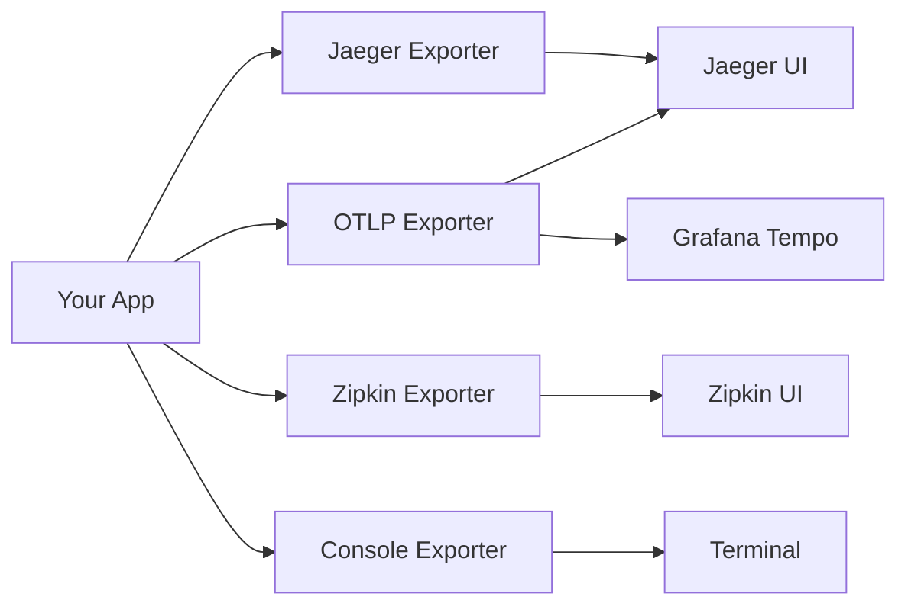

# Exporters

Send traces to various observability backends.

## Overview



## OTLP Exporter

**Recommended for production.** OpenTelemetry Protocol is vendor-neutral.

### Installation

```bash
npm install @opentelemetry/exporter-trace-otlp-http
```

### Configuration

```typescript
import { TracingPlugin } from '@nestjs-redisx/tracing';

new TracingPlugin({
  serviceName: 'user-service',
  exporter: {
    type: 'otlp',
    endpoint: 'http://localhost:4318',
  },
})
```

### With Custom Headers

```typescript
{
  exporter: {
    type: 'otlp',
    endpoint: 'http://collector:4318',
    headers: {
      'x-api-key': process.env.TRACING_API_KEY,
      'x-tenant-id': 'my-tenant',
    },
  }
}
```

### Docker Compose Setup

```yaml
# docker-compose.yml
version: '3.8'

services:
  app:
    build: .
    environment:
      - OTLP_ENDPOINT=http://jaeger:4318
    depends_on:
      - jaeger

  jaeger:
    image: jaegertracing/all-in-one:latest
    ports:
      - "16686:16686"  # UI
      - "4318:4318"    # OTLP HTTP
    environment:
      - COLLECTOR_OTLP_ENABLED=true
```

### Kubernetes Setup

```yaml
# deployment.yaml
apiVersion: v1
kind: ConfigMap
metadata:
  name: tracing-config
data:
  OTLP_ENDPOINT: "http://otel-collector:4318"
---
apiVersion: apps/v1
kind: Deployment
metadata:
  name: user-service
spec:
  template:
    spec:
      containers:
        - name: app
          envFrom:
            - configMapRef:
                name: tracing-config
```

## Jaeger Exporter

Export to Jaeger via OTLP. Internally uses the same OTLP exporter — point to your Jaeger OTLP endpoint.

### Configuration

```typescript
{
  exporter: {
    type: 'jaeger',
    endpoint: 'http://jaeger:4318/v1/traces',
  }
}
```

### Docker Compose

```yaml
jaeger:
  image: jaegertracing/all-in-one:latest
  ports:
    - "16686:16686"  # UI
    - "14268:14268"  # HTTP collector
    - "6831:6831/udp"  # UDP agent
```

### Access Jaeger UI

```
http://localhost:16686
```

**Features:**
- Search traces by service, operation, tags
- Trace timeline visualization
- Service dependencies graph
- Performance analytics

## Zipkin Exporter

Export to Zipkin-compatible backends via OTLP. Internally uses the same OTLP exporter.

### Configuration

```typescript
{
  exporter: {
    type: 'zipkin',
    endpoint: 'http://zipkin:9411/api/v2/spans',
  }
}
```

### Docker Compose

```yaml
zipkin:
  image: openzipkin/zipkin:latest
  ports:
    - "9411:9411"
```

### Access Zipkin UI

```
http://localhost:9411
```

## Console Exporter

Development debugging - prints spans to console.

### Configuration

```typescript
{
  exporter: {
    type: 'console',
  }
}
```

### Output

```json
{
  "traceId": "7f9c8a3b2e1d4c5a6b7e8f9a0b1c2d3e",
  "spanId": "1a2b3c4d5e6f7g8h",
  "name": "redis.GET",
  "kind": "CLIENT",
  "timestamp": 1706123456789000,
  "duration": 1234567,
  "attributes": {
    "db.system": "redis",
    "db.operation": "GET",
    "db.redis.key": "user:123"
  },
  "status": {
    "code": "OK"
  }
}
```

**Use cases:**
- Local development
- CI/CD debugging
- Quick testing

## Grafana Tempo

Store traces in Grafana Tempo via OTLP.

### Docker Compose

```yaml
version: '3.8'

services:
  tempo:
    image: grafana/tempo:latest
    ports:
      - "4318:4318"  # OTLP HTTP
      - "3200:3200"  # Tempo UI
    volumes:
      - ./tempo.yaml:/etc/tempo.yaml
    command: ["-config.file=/etc/tempo.yaml"]

  grafana:
    image: grafana/grafana:latest
    ports:
      - "3000:3000"
    environment:
      - GF_AUTH_ANONYMOUS_ENABLED=true
      - GF_AUTH_ANONYMOUS_ORG_ROLE=Admin
    volumes:
      - ./grafana-datasources.yaml:/etc/grafana/provisioning/datasources/datasources.yaml
```

### Tempo Configuration

```yaml
# tempo.yaml
server:
  http_listen_port: 3200

distributor:
  receivers:
    otlp:
      protocols:
        http:
          endpoint: 0.0.0.0:4318

storage:
  trace:
    backend: local
    local:
      path: /tmp/tempo/blocks
```

### Grafana Data Source

```yaml
# grafana-datasources.yaml
apiVersion: 1

datasources:
  - name: Tempo
    type: tempo
    access: proxy
    url: http://tempo:3200
```

### Application Configuration

```typescript
{
  exporter: {
    type: 'otlp',
    endpoint: 'http://tempo:4318',
  }
}
```

## Multiple Exporters

Export to multiple backends simultaneously.

### Setup

```typescript
import { BatchSpanProcessor, SimpleSpanProcessor } from '@opentelemetry/sdk-trace-base';
import { OTLPTraceExporter } from '@opentelemetry/exporter-trace-otlp-http';
import { ConsoleSpanExporter } from '@opentelemetry/sdk-trace-base';
import { NodeTracerProvider } from '@opentelemetry/sdk-trace-node';

const provider = new NodeTracerProvider();

// OTLP to production
provider.addSpanProcessor(
  new BatchSpanProcessor(
    new OTLPTraceExporter({
      url: 'http://collector:4318/v1/traces',
    }),
  ),
);

// Console for debugging
if (process.env.NODE_ENV === 'development') {
  provider.addSpanProcessor(
    new SimpleSpanProcessor(new ConsoleSpanExporter()),
  );
}

provider.register();
```

## Cloud Providers

### AWS X-Ray

```bash
npm install @opentelemetry/propagator-aws-xray
```

```typescript
import { AWSXRayPropagator } from '@opentelemetry/propagator-aws-xray';
import { AWSXRayIdGenerator } from '@opentelemetry/id-generator-aws-xray';

const sdk = new NodeSDK({
  textMapPropagator: new AWSXRayPropagator(),
  idGenerator: new AWSXRayIdGenerator(),
  traceExporter: new OTLPTraceExporter({
    url: 'https://YOUR_REGION.amazonaws.com/v1/traces',
  }),
});
```

### Google Cloud Trace

```bash
npm install @google-cloud/opentelemetry-cloud-trace-exporter
```

```typescript
import { TraceExporter } from '@google-cloud/opentelemetry-cloud-trace-exporter';

const exporter = new TraceExporter({
  projectId: 'your-gcp-project',
});
```

### Azure Monitor

```bash
npm install @azure/monitor-opentelemetry-exporter
```

```typescript
import { AzureMonitorTraceExporter } from '@azure/monitor-opentelemetry-exporter';

const exporter = new AzureMonitorTraceExporter({
  connectionString: process.env.APPLICATIONINSIGHTS_CONNECTION_STRING,
});
```

## Commercial Platforms

### Datadog

```bash
npm install @opentelemetry/exporter-trace-otlp-http
```

```typescript
{
  exporter: {
    type: 'otlp',
    endpoint: 'https://trace.agent.datadoghq.com/v1/traces',
    headers: {
      'DD-API-KEY': process.env.DATADOG_API_KEY,
    },
  }
}
```

### New Relic

```typescript
{
  exporter: {
    type: 'otlp',
    endpoint: 'https://otlp.nr-data.net:4318/v1/traces',
    headers: {
      'api-key': process.env.NEW_RELIC_LICENSE_KEY,
    },
  }
}
```

### Honeycomb

```typescript
{
  exporter: {
    type: 'otlp',
    endpoint: 'https://api.honeycomb.io/v1/traces',
    headers: {
      'x-honeycomb-team': process.env.HONEYCOMB_API_KEY,
      'x-honeycomb-dataset': 'my-service',
    },
  }
}
```

## Exporter Comparison

| Exporter | Use Case | Pros | Cons |
|----------|----------|------|------|
| **OTLP** | Production | Vendor-neutral, future-proof | Requires collector |
| **Jaeger** | Development | Easy setup, good UI | Uses OTLP internally |
| **Zipkin** | Legacy systems | Wide support | Uses OTLP internally |
| **Console** | Debugging | No infrastructure needed | Not for production |

::: info
All exporter types except `'console'` use `OTLPTraceExporter` internally. The `type` field mainly serves as semantic labeling — you must configure the appropriate `endpoint` for your backend.
:::

## Performance Considerations

### Batch Size

```typescript
import { BatchSpanProcessor } from '@opentelemetry/sdk-trace-base';

const processor = new BatchSpanProcessor(exporter, {
  maxQueueSize: 2048,          // Queue size
  maxExportBatchSize: 512,     // Batch size
  scheduledDelayMillis: 5000,  // Export interval
  exportTimeoutMillis: 30000,  // Timeout
});
```

**High traffic:**
- Increase `maxQueueSize`
- Increase `maxExportBatchSize`
- Reduce `scheduledDelayMillis`

**Low traffic:**
- Decrease `maxExportBatchSize`
- Increase `scheduledDelayMillis`

## Troubleshooting

### Spans not appearing

```bash
# Check exporter endpoint
curl http://localhost:4318/v1/traces

# Check logs
docker logs <container-id>
```

### Authentication errors

```typescript
{
  exporter: {
    headers: {
      'authorization': `Bearer ${process.env.API_TOKEN}`,
    },
  }
}
```

## Next Steps

- [Configuration](./configuration) — Full config options
- [Visualization](./visualization) — Analyze traces
- [Troubleshooting](./troubleshooting) — Debug issues
