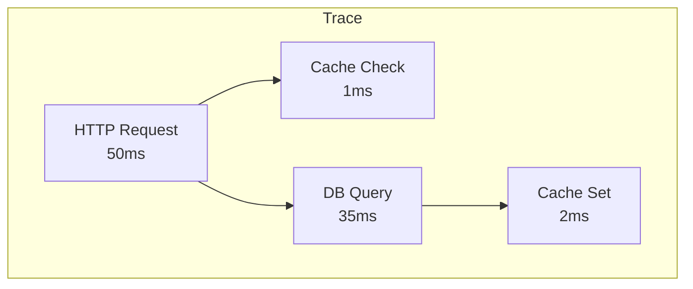
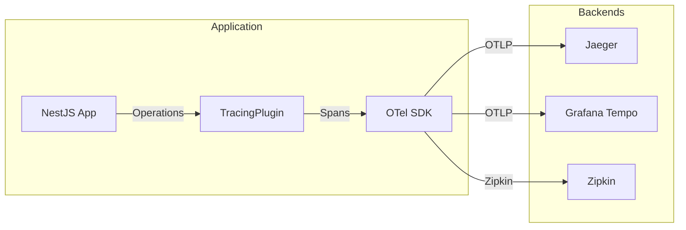

# Tracing Plugin

Trace Redis operations across your distributed system.

## Overview

| Question | Without Tracing | With Tracing Plugin |
|----------|-----------------|---------------------|
| Where is latency? | Unknown | Redis GET: 2ms |
| Request flow? | Guesswork | Trace visualization |
| Which cache missed? | Logs search | Span attributes |
| Error origin? | Stack trace | Distributed context |

## Key Features

- **Spans** — Redis commands, cache operations, lock acquire/release, rate limit checks
- **Context Propagation** — Trace propagation, parent-child spans
- **Exporters** — OTLP, Jaeger, Zipkin, Console
- **Sampling** — Always, Never, Ratio, Parent-based

## Installation

::: code-group

```bash [ioredis]
npm install @nestjs-redisx/core @nestjs-redisx/tracing ioredis
```

```bash [node-redis]
npm install @nestjs-redisx/core @nestjs-redisx/tracing redis
```

:::

## Basic Configuration

<<< @/apps/demo/src/plugins/tracing/basic-config.setup.ts{typescript}

## Viewing Traces

Open Jaeger UI at `http://localhost:16686`:

```
Trace: GET /api/users/123
├── HTTP GET /api/users/123 (50ms)
│   ├── redis.GET user:123 (1ms) ← Cache miss
│   ├── database.query (35ms)
│   └── redis.SET user:123 (2ms) ← Cache set
```

## Trace Flow



## Span Attributes

Each Redis span includes:

```json
{
  "name": "redis.GET",
  "attributes": {
    "db.system": "redis",
    "db.operation": "GET",
    "db.redis.key": "user:123",
    "redisx.plugin": "cache",
    "redisx.cache.hit": false,
    "redisx.duration_ms": 1.23
  }
}
```

## Architecture



## Documentation

| Topic | Description |
|-------|-------------|
| [Core Concepts](./concepts) | Understanding distributed tracing |
| [Configuration](./configuration) | Configuration reference |
| [OpenTelemetry](./opentelemetry) | OTel integration |
| [Exporters](./exporters) | Exporter configuration |
| [Spans](./spans) | Span details |
| [Plugin Tracing](./plugin-tracing) | Per-plugin tracing |
| [Sampling](./sampling) | Sampling strategies |
| [Visualization](./visualization) | Viewing traces |
| [Troubleshooting](./troubleshooting) | Debugging common issues |
