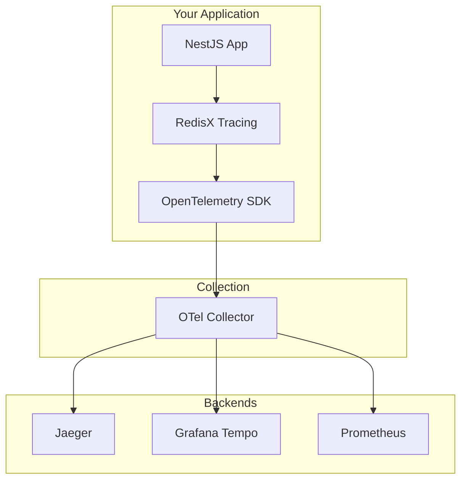

# OpenTelemetry

Integrate NestJS RedisX tracing with OpenTelemetry ecosystem.

## What is OpenTelemetry?

**OpenTelemetry (OTel)** is an open-source observability framework for:
- **Traces** — Request flow through distributed systems
- **Metrics** — Performance measurements
- **Logs** — Event records



## Installation

```bash
npm install @opentelemetry/sdk-node \
            @opentelemetry/auto-instrumentations-node \
            @opentelemetry/exporter-trace-otlp-http
```

## Basic Setup

### 1. Create Tracing Configuration

```typescript
// src/tracing.ts
import { NodeSDK } from '@opentelemetry/sdk-node';
import { getNodeAutoInstrumentations } from '@opentelemetry/auto-instrumentations-node';
import { OTLPTraceExporter } from '@opentelemetry/exporter-trace-otlp-http';
import { Resource } from '@opentelemetry/resources';
import { SemanticResourceAttributes } from '@opentelemetry/semantic-conventions';

const sdk = new NodeSDK({
  resource: new Resource({
    [SemanticResourceAttributes.SERVICE_NAME]: 'user-service',
    [SemanticResourceAttributes.SERVICE_VERSION]: '1.0.0',
  }),
  traceExporter: new OTLPTraceExporter({
    url: 'http://localhost:4318/v1/traces',
  }),
  instrumentations: [
    getNodeAutoInstrumentations({
      '@opentelemetry/instrumentation-http': { enabled: true },
      '@opentelemetry/instrumentation-express': { enabled: true },
    }),
  ],
});

sdk.start();

// Graceful shutdown
process.on('SIGTERM', () => {
  sdk
    .shutdown()
    .then(() => console.log('Tracing terminated'))
    .catch((error) => console.error('Error terminating tracing', error))
    .finally(() => process.exit(0));
});
```

### 2. Initialize Before Application

```typescript
// src/main.ts
import './tracing';  // ← MUST be first import!

import { NestFactory } from '@nestjs/core';
import { AppModule } from './app.module';

async function bootstrap() {
  const app = await NestFactory.create(AppModule);
  await app.listen(3000);
}
bootstrap();
```

### 3. Configure RedisX Tracing Plugin

```typescript
// app.module.ts
import { Module } from '@nestjs/common';
import { RedisModule } from '@nestjs-redisx/core';
import { TracingPlugin } from '@nestjs-redisx/tracing';

@Module({
  imports: [
    RedisModule.forRoot({
      clients: {
        host: 'localhost',
        port: 6379,
      },
      plugins: [
        new TracingPlugin({
          serviceName: 'user-service',
          exporter: {
            type: 'otlp',
            endpoint: 'http://localhost:4318',
          },
        }),
      ],
    }),
  ],
})
export class AppModule {}
```

## Auto-Instrumentation

OpenTelemetry automatically instruments common libraries.

### HTTP Instrumentation

Traces incoming HTTP requests.

```typescript
import { HttpInstrumentation } from '@opentelemetry/instrumentation-http';

instrumentations: [
  new HttpInstrumentation({
    ignoreIncomingPaths: ['/health', '/metrics'],
  }),
]
```

**Result:**

```
Trace ID: abc123
├── HTTP GET /api/users/123 (50ms)
│   ├── redis.GET user:123 (1ms) ← RedisX
│   ├── database.query (35ms)
│   └── redis.SET user:123 (2ms) ← RedisX
```

### Express Instrumentation

Adds route information to HTTP spans.

```typescript
import { ExpressInstrumentation } from '@opentelemetry/instrumentation-express';

instrumentations: [
  new ExpressInstrumentation(),
]
```

**Span attributes:**

```json
{
  "http.method": "GET",
  "http.route": "/api/users/:id",
  "http.target": "/api/users/123",
  "http.status_code": 200
}
```

### Database Instrumentation

Traces database queries alongside Redis operations.

```typescript
import { PgInstrumentation } from '@opentelemetry/instrumentation-pg';

instrumentations: [
  new PgInstrumentation(),
]
```

**Result:**

```
GET /api/users/123
├── redis.GET user:123 (miss)
├── pg.query SELECT * FROM users WHERE id = $1 (30ms)
└── redis.SET user:123 (2ms)
```

## Context Propagation

OpenTelemetry automatically propagates context across:
- HTTP requests (W3C Trace Context headers)
- Async operations (AsyncLocalStorage)
- Database queries
- Redis commands

### HTTP Headers

```http
GET /api/users/123 HTTP/1.1
traceparent: 00-abc123-def456-01
tracestate: redisx=789
```

**Format:** `version-trace_id-parent_id-flags`

### Async Context

```typescript
import { context, trace } from '@opentelemetry/api';

@Get('/users/:id')
async getUser(@Param('id') id: string) {
  const span = trace.getActiveSpan();  // Current HTTP span

  // Redis span inherits context automatically
  const user = await this.cache.get(`user:${id}`);

  return user;
}
```

## Manual Instrumentation

Create custom spans alongside auto-instrumentation.

### Using TracingService

<<< @/apps/demo/src/plugins/tracing/service-manual-instrumentation.usage.ts{typescript}

### Using OpenTelemetry API Directly

```typescript
import { trace } from '@opentelemetry/api';

const tracer = trace.getTracer('user-service');

async function processOrder(orderId: string): Promise<void> {
  const span = tracer.startSpan('process.order');

  try {
    span.setAttribute('order.id', orderId);

    await validateOrder(orderId);
    await chargePayment(orderId);

    span.setStatus({ code: SpanStatusCode.OK });
  } catch (error) {
    span.setStatus({
      code: SpanStatusCode.ERROR,
      message: error.message,
    });
    span.recordException(error);
    throw error;
  } finally {
    span.end();
  }
}
```

## Semantic Conventions

Follow OpenTelemetry semantic conventions for consistency.

### Database Operations

```typescript
span.setAttributes({
  'db.system': 'redis',
  'db.operation': 'GET',
  'db.statement': 'GET user:123',
  'db.redis.database_index': 0,
});
```

### HTTP Operations

```typescript
span.setAttributes({
  'http.method': 'GET',
  'http.url': 'https://api.example.com/users/123',
  'http.status_code': 200,
  'http.response_content_length': 1234,
});
```

### Custom Operations

```typescript
span.setAttributes({
  'service.name': 'user-service',
  'service.version': '1.2.3',
  'deployment.environment': 'production',
});
```

## Sampling

### Built-in Samplers

```typescript
import { TraceIdRatioBasedSampler, AlwaysOnSampler, AlwaysOffSampler } from '@opentelemetry/sdk-trace-base';

// 10% sampling
const sdk = new NodeSDK({
  sampler: new TraceIdRatioBasedSampler(0.1),
});

// Always sample
const sdk = new NodeSDK({
  sampler: new AlwaysOnSampler(),
});

// Never sample
const sdk = new NodeSDK({
  sampler: new AlwaysOffSampler(),
});
```

### Custom Sampler

```typescript
import { Sampler, SamplingDecision } from '@opentelemetry/sdk-trace-base';

class CustomSampler implements Sampler {
  shouldSample(context, traceId, spanName, spanKind, attributes) {
    // Always sample errors
    if (attributes['http.status_code'] >= 400) {
      return { decision: SamplingDecision.RECORD_AND_SAMPLED };
    }

    // Sample 1% of success requests
    if (Math.random() < 0.01) {
      return { decision: SamplingDecision.RECORD_AND_SAMPLED };
    }

    return { decision: SamplingDecision.NOT_RECORD };
  }
}

const sdk = new NodeSDK({
  sampler: new CustomSampler(),
});
```

## Span Processors

### Batch Processor (Production)

```typescript
import { BatchSpanProcessor } from '@opentelemetry/sdk-trace-base';
import { OTLPTraceExporter } from '@opentelemetry/exporter-trace-otlp-http';

const exporter = new OTLPTraceExporter({
  url: 'http://localhost:4318/v1/traces',
});

const processor = new BatchSpanProcessor(exporter, {
  maxQueueSize: 2048,
  maxExportBatchSize: 512,
  scheduledDelayMillis: 5000,
  exportTimeoutMillis: 30000,
});
```

**Benefits:**
- Batches spans for efficiency
- Reduces network overhead
- Better performance

### Simple Processor (Development)

```typescript
import { SimpleSpanProcessor } from '@opentelemetry/sdk-trace-base';
import { ConsoleSpanExporter } from '@opentelemetry/sdk-trace-base';

const processor = new SimpleSpanProcessor(new ConsoleSpanExporter());
```

**Benefits:**
- Immediate export
- Real-time debugging
- No batching delay

## Resource Detection

Automatically detect deployment environment.

```typescript
import { detectResources, envDetector, hostDetector, processDetector } from '@opentelemetry/resources';

const resource = await detectResources({
  detectors: [envDetector, hostDetector, processDetector],
});

const sdk = new NodeSDK({ resource });
```

**Detected attributes:**

```json
{
  "host.name": "ip-10-0-1-42",
  "host.arch": "x64",
  "process.pid": 1234,
  "process.executable.name": "node",
  "process.runtime.name": "nodejs",
  "process.runtime.version": "20.10.0"
}
```

## Best Practices

**1. Initialize tracing before app**

```typescript
// main.ts
import './tracing';  // ← First!
import { NestFactory } from '@nestjs/core';
```

**2. Use BatchSpanProcessor in production**

```typescript
const processor = new BatchSpanProcessor(exporter);
```

**3. Follow semantic conventions**

```typescript
// ✅ Good
span.setAttribute('db.system', 'redis');

// ❌ Bad
span.setAttribute('database', 'redis');
```

**4. Handle errors in spans**

```typescript
try {
  await operation();
  span.setStatus({ code: SpanStatusCode.OK });
} catch (error) {
  span.setStatus({ code: SpanStatusCode.ERROR });
  span.recordException(error);
  throw error;
}
```

**5. Always end spans**

```typescript
const span = tracer.startSpan('operation');
try {
  await doWork();
} finally {
  span.end();  // ← Always!
}
```

## Next Steps

- [Exporters](./exporters) — Configure exporters
- [Spans](./spans) — Create custom spans
- [Sampling](./sampling) — Sampling strategies
