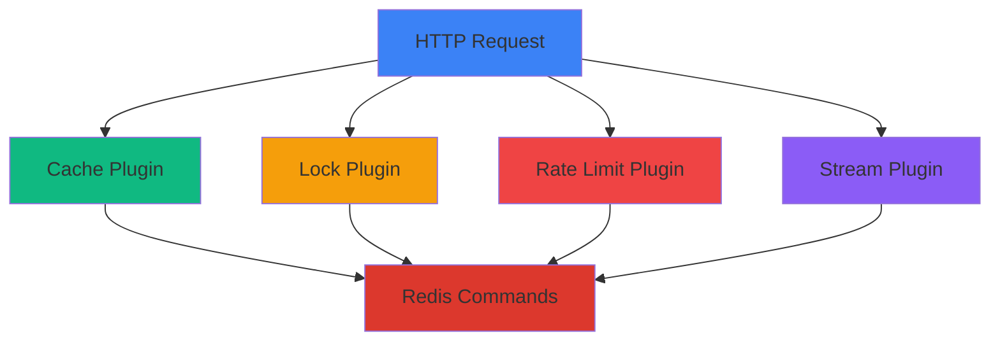
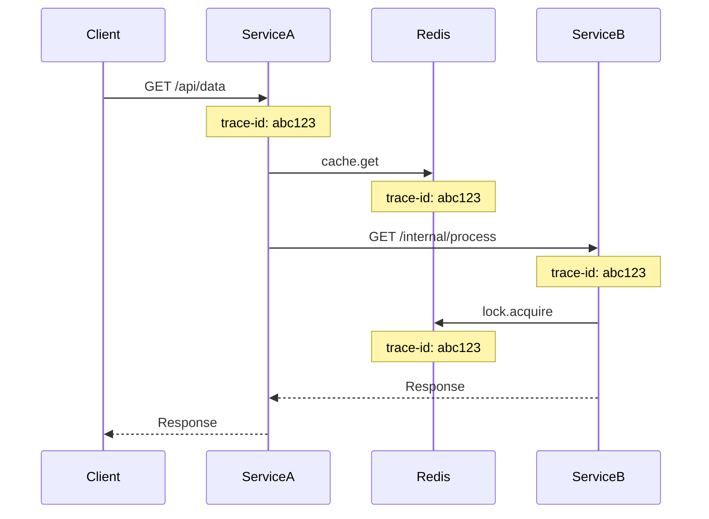

# Plugin Tracing

Automatic distributed tracing for all NestJS RedisX plugins.

## Overview

When TracingPlugin is enabled, all other plugins automatically create spans.



## Setup

Simply register TracingPlugin alongside other plugins.

<<< @/apps/demo/src/plugins/tracing/multi-plugin.setup.ts{typescript}

## Cache Plugin Tracing

### Automatic Spans

Every cache operation creates a span:

```
GET /api/users/123
└── cache.get (1ms)
    ├── Attribute: cache.namespace = "users"
    ├── Attribute: cache.key = "user:123"
    ├── Attribute: cache.hit = false
    └── Event: cache.miss
```

### Span Attributes

```typescript
{
  "name": "cache.get",
  "attributes": {
    "db.system": "redis",
    "db.operation": "GET",
    "redisx.plugin": "cache",
    "redisx.cache.namespace": "users",
    "redisx.cache.key": "user:123",
    "redisx.cache.hit": false,
    "redisx.duration_ms": 1.23
  }
}
```

### Cache Hit Flow

```
GET /api/users/123 (5ms)
└── cache.get user:123 (1ms)
    ├── cache.hit = true
    └── Event: cache.hit
```

### Cache Miss Flow

```
GET /api/users/123 (50ms)
├── cache.get user:123 (1ms)
│   ├── cache.hit = false
│   └── Event: cache.miss
├── database.query (35ms)
└── cache.set user:123 (2ms)
    └── Event: cache.stored
```

### Tag Invalidation

```
POST /api/users/123 (20ms)
├── cache.invalidate_by_tags (5ms)
│   ├── Attribute: tags = ["user:123", "users"]
│   ├── Event: tag.lookup
│   ├── Event: keys.found (count: 3)
│   └── Event: keys.deleted (count: 3)
└── database.update (10ms)
```

## Lock Plugin Tracing

### Lock Acquisition

```
POST /api/process (100ms)
├── lock.acquire order:123 (2ms)
│   ├── Attribute: lock.key = "order:123"
│   ├── Attribute: lock.ttl = 30000
│   ├── Attribute: lock.acquired = true
│   └── Event: lock.acquired
├── process.order (80ms)
│   └── ...business logic...
└── lock.release order:123 (1ms)
    └── Event: lock.released
```

### Lock Contention

```
POST /api/process (5000ms)
├── lock.acquire order:123 (5000ms)
│   ├── Attribute: lock.acquired = false
│   ├── Event: lock.retry (attempt: 1)
│   ├── Event: lock.retry (attempt: 2)
│   ├── Event: lock.retry (attempt: 3)
│   └── Event: lock.timeout
└── Status: ERROR
    └── Message: "Failed to acquire lock"
```

### Span Attributes

```typescript
{
  "name": "lock.acquire",
  "attributes": {
    "db.system": "redis",
    "db.operation": "SET",
    "redisx.plugin": "locks",
    "redisx.lock.key": "order:123",
    "redisx.lock.ttl": 30000,
    "redisx.lock.acquired": true,
    "redisx.lock.retry_count": 0,
    "redisx.duration_ms": 2.45
  }
}
```

## Rate Limit Plugin Tracing

### Allowed Request

```
GET /api/data (10ms)
├── rate_limit.check (1ms)
│   ├── Attribute: key = "ip:192.168.1.1"
│   ├── Attribute: limit = 100
│   ├── Attribute: window = 60
│   ├── Attribute: current = 45
│   ├── Attribute: remaining = 55
│   ├── Attribute: allowed = true
│   └── Event: request.allowed
└── process.request (8ms)
```

### Blocked Request

```
GET /api/data (1ms)
└── rate_limit.check (1ms)
    ├── Attribute: key = "ip:192.168.1.1"
    ├── Attribute: limit = 100
    ├── Attribute: window = 60
    ├── Attribute: current = 101
    ├── Attribute: remaining = 0
    ├── Attribute: allowed = false
    ├── Event: request.blocked
    └── Status: ERROR
        └── Message: "Rate limit exceeded"
```

### Span Attributes

```typescript
{
  "name": "rate_limit.check",
  "attributes": {
    "db.system": "redis",
    "db.operation": "INCR",
    "redisx.plugin": "rate-limit",
    "redisx.rate_limit.key": "ip:192.168.1.1",
    "redisx.rate_limit.limit": 100,
    "redisx.rate_limit.window": 60,
    "redisx.rate_limit.current": 45,
    "redisx.rate_limit.remaining": 55,
    "redisx.rate_limit.allowed": true,
    "redisx.duration_ms": 0.87
  }
}
```

## Stream Plugin Tracing

### Producer Span

```
POST /api/orders (15ms)
├── order.create (10ms)
│   └── database.insert (8ms)
└── stream.publish (3ms)
    ├── Attribute: stream = "orders"
    ├── Attribute: message_id = "1706123456789-0"
    ├── Attribute: message_size = 256
    └── Event: message.published
```

### Consumer Span

```
stream.consume (50ms) [CONSUMER]
├── Attribute: stream = "orders"
├── Attribute: group = "order-processors"
├── Attribute: consumer = "worker-1"
├── Attribute: message_id = "1706123456789-0"
├── Event: message.received
├── process.order (45ms)
│   └── ...business logic...
├── Event: message.processed
└── stream.ack (1ms)
    └── Event: message.acknowledged
```

### DLQ Span

```
stream.consume (100ms)
├── Event: message.received
├── process.order (80ms)
│   └── Status: ERROR
├── Event: processing.failed (attempt: 3)
└── stream.move_to_dlq (5ms)
    ├── Attribute: dlq_stream = "orders:dlq"
    ├── Attribute: reason = "MaxRetriesExceeded"
    └── Event: message.moved_to_dlq
```

## Complete Request Flow

```mermaid
gantt
    title Request Trace Timeline
    dateFormat x
    axisFormat %L ms

    section HTTP
    Request :0, 100

    section Rate Limit
    Check :2, 3

    section Cache
    GET user:123 :5, 7

    section Database
    Query users :10, 50

    section Cache
    SET user:123 :52, 55

    section Lock
    Acquire :56, 58
    Process :60, 85
    Release :87, 88
```

**Trace output:**

```
GET /api/users/123 (100ms)
├── rate_limit.check (1ms)
│   └── allowed = true
├── cache.get user:123 (2ms)
│   └── cache.hit = false
├── database.query (40ms)
├── cache.set user:123 (3ms)
├── lock.acquire process:123 (2ms)
├── process.data (25ms)
└── lock.release process:123 (1ms)
```

## Distributed Tracing

Trace requests across multiple services.

### Service A → Service B



**Trace visualization:**

```
trace-id: abc123
├── Service A: GET /api/data (150ms)
│   ├── cache.get data:xyz (2ms)
│   └── HTTP GET /internal/process (120ms)
│       └── Service B: GET /internal/process (115ms)
│           ├── lock.acquire process:xyz (3ms)
│           ├── process.data (100ms)
│           └── lock.release process:xyz (2ms)
```

## Configuration

### Enable/Disable Plugin Tracing

```typescript
new TracingPlugin({
  pluginTracing: true,  // Enable plugin tracing
})
```

## Sampling

Sample plugin spans separately from application spans.

```typescript
import { Sampler, SamplingDecision } from '@opentelemetry/sdk-trace-base';

class PluginSampler implements Sampler {
  shouldSample(context, traceId, spanName, spanKind, attributes) {
    // Always sample errors
    if (attributes['redisx.error']) {
      return { decision: SamplingDecision.RECORD_AND_SAMPLED };
    }

    // Always sample slow operations
    if (attributes['redisx.duration_ms'] > 100) {
      return { decision: SamplingDecision.RECORD_AND_SAMPLED };
    }

    // Sample 1% of cache hits
    if (spanName === 'cache.get' && attributes['redisx.cache.hit']) {
      return Math.random() < 0.01
        ? { decision: SamplingDecision.RECORD_AND_SAMPLED }
        : { decision: SamplingDecision.NOT_RECORD };
    }

    // Sample 10% of other operations
    return Math.random() < 0.1
      ? { decision: SamplingDecision.RECORD_AND_SAMPLED }
      : { decision: SamplingDecision.NOT_RECORD };
  }
}
```

## Performance Impact

Plugin tracing adds minimal overhead:

| Operation | Without Tracing | With Tracing | Overhead |
|-----------|----------------|--------------|----------|
| Cache GET | 0.5ms | 0.52ms | +4% |
| Cache SET | 1.0ms | 1.03ms | +3% |
| Lock Acquire | 2.0ms | 2.06ms | +3% |
| Rate Limit | 0.8ms | 0.82ms | +2.5% |
| Stream Publish | 1.5ms | 1.55ms | +3.3% |

**Recommendations:**
- Use sampling in production (1-10%)
- Always sample errors and slow operations
- Disable tracing for high-frequency operations if needed

## Best Practices

**1. Enable plugin tracing in development**

```typescript
{
  pluginTracing: process.env.NODE_ENV !== 'production',
}
```

**2. Sample in production**

```typescript
{
  sampling: {
    strategy: 'ratio',
    ratio: 0.01,  // 1%
  }
}
```

**3. Always sample errors**

Use custom sampler to always trace errors regardless of ratio.

**4. Monitor trace volume**

Check Jaeger/Tempo for trace count and adjust sampling accordingly.

## Next Steps

- [Spans](./spans) — Create custom spans
- [Sampling](./sampling) — Sampling strategies
- [Visualization](./visualization) — Analyze traces
