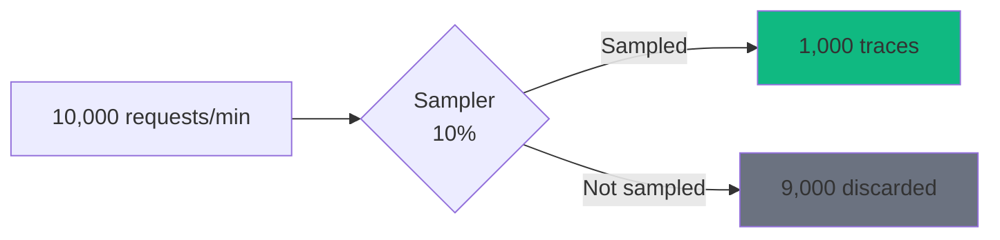
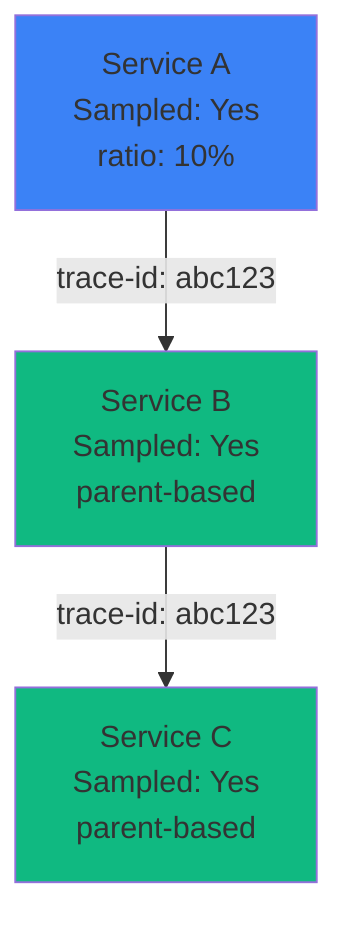

# Sampling

Decide which traces to collect to balance observability and costs.

## Why Sampling?

**Without sampling:**
- High storage costs
- Performance impact
- Overwhelming data volume

**With sampling:**
- Controlled costs
- Minimal performance impact
- Representative data



## Sampling Strategies

### Always Sample

Collect 100% of traces.

```typescript
{
  sampling: {
    strategy: 'always',
  }
}
```

**Use cases:**
- Development
- Debugging
- Low-traffic services

**Pros:**
- Complete visibility
- No missing traces

**Cons:**
- High storage costs
- Performance impact at scale

### Never Sample

Collect 0% of traces.

```typescript
{
  sampling: {
    strategy: 'never',
  }
}
```

**Use cases:**
- Temporarily disable tracing
- Testing without tracing overhead

### Ratio-Based Sampling

Collect a fixed percentage of traces.

```typescript
{
  sampling: {
    strategy: 'ratio',
    ratio: 0.1,  // 10%
  }
}
```

**Use cases:**
- Production with high traffic
- Cost-controlled environments

**Calculation:**

```
Traces collected = Total requests × Ratio
1,000 traces = 10,000 requests × 0.1
```

**Recommended ratios:**

| Traffic | Ratio | Traces/min |
|---------|-------|------------|
| < 100 req/min | 1.0 (100%) | < 100 |
| 100-1,000 | 0.5 (50%) | 50-500 |
| 1,000-10,000 | 0.1 (10%) | 100-1,000 |
| 10,000-100,000 | 0.01 (1%) | 100-1,000 |
| > 100,000 | 0.001 (0.1%) | 100-1,000 |

### Parent-Based Sampling

Follow parent span's sampling decision.

```typescript
{
  sampling: {
    strategy: 'parent',
  }
}
```

**How it works:**



**Use cases:**
- Microservices architecture
- Consistent sampling across services

**Benefits:**
- Complete distributed traces
- No partial traces
- Consistent sampling decision

## Environment-Based Configuration

```typescript
import { TracingPlugin } from '@nestjs-redisx/tracing';

const getSamplingConfig = () => {
  switch (process.env.NODE_ENV) {
    case 'production':
      return { strategy: 'ratio', ratio: 0.01 };  // 1%
    case 'staging':
      return { strategy: 'ratio', ratio: 0.1 };   // 10%
    case 'development':
      return { strategy: 'always' };               // 100%
    default:
      return { strategy: 'ratio', ratio: 0.05 };  // 5%
  }
};

new TracingPlugin({
  serviceName: 'my-service',
  sampling: getSamplingConfig(),
  exporter: {
    type: 'otlp',
    endpoint: process.env.OTLP_ENDPOINT,
  },
})
```

## Custom Sampling

### Head-Based Sampling

Decision made at trace start (root span).

```typescript
import { Sampler, SamplingDecision, SamplingResult } from '@opentelemetry/sdk-trace-base';

class CustomSampler implements Sampler {
  shouldSample(
    context,
    traceId,
    spanName,
    spanKind,
    attributes,
    links,
  ): SamplingResult {
    // Always sample errors
    if (attributes['http.status_code'] >= 400) {
      return {
        decision: SamplingDecision.RECORD_AND_SAMPLED,
        attributes: { 'sampling.reason': 'error' },
      };
    }

    // Always sample slow requests
    if (attributes['http.target']?.includes('/slow')) {
      return {
        decision: SamplingDecision.RECORD_AND_SAMPLED,
        attributes: { 'sampling.reason': 'slow_endpoint' },
      };
    }

    // Always sample specific users
    if (attributes['user.role'] === 'admin') {
      return {
        decision: SamplingDecision.RECORD_AND_SAMPLED,
        attributes: { 'sampling.reason': 'admin_user' },
      };
    }

    // 1% for everything else
    if (Math.random() < 0.01) {
      return {
        decision: SamplingDecision.RECORD_AND_SAMPLED,
        attributes: { 'sampling.reason': 'random' },
      };
    }

    return { decision: SamplingDecision.NOT_RECORD };
  }

  toString(): string {
    return 'CustomSampler';
  }
}
```

**Usage:**

```typescript
import { NodeSDK } from '@opentelemetry/sdk-node';

const sdk = new NodeSDK({
  sampler: new CustomSampler(),
  // ... other config
});

sdk.start();
```

### Tail-Based Sampling

Decision made after trace completes (at collector level).

**Benefits:**
- Sample based on full trace data
- Always keep errors
- Always keep slow requests

**Setup with OpenTelemetry Collector:**

```yaml
# otel-collector-config.yaml
receivers:
  otlp:
    protocols:
      http:
        endpoint: 0.0.0.0:4318

processors:
  tail_sampling:
    decision_wait: 10s
    num_traces: 100
    expected_new_traces_per_sec: 10
    policies:
      # Always sample errors
      - name: error-policy
        type: status_code
        status_code:
          status_codes:
            - ERROR

      # Always sample slow traces (> 1s)
      - name: latency-policy
        type: latency
        latency:
          threshold_ms: 1000

      # Always sample specific endpoints
      - name: critical-endpoints
        type: string_attribute
        string_attribute:
          key: http.target
          values:
            - /api/payment
            - /api/checkout

      # 1% of everything else
      - name: probabilistic-policy
        type: probabilistic
        probabilistic:
          sampling_percentage: 1

exporters:
  otlp:
    endpoint: jaeger:4317

service:
  pipelines:
    traces:
      receivers: [otlp]
      processors: [tail_sampling]
      exporters: [otlp]
```

## Sampling by Endpoint

```typescript
class EndpointSampler implements Sampler {
  private readonly samplingRates = {
    '/health': 0,         // Never sample health checks
    '/metrics': 0,        // Never sample metrics endpoint
    '/api/payment': 1.0,  // Always sample payments
    '/api/checkout': 1.0, // Always sample checkout
    '/api/search': 0.01,  // 1% of searches
  };

  shouldSample(context, traceId, spanName, spanKind, attributes): SamplingResult {
    const endpoint = attributes['http.target'] as string;

    // Get sampling rate for this endpoint
    const rate = this.getRate(endpoint);

    if (rate === 0) {
      return { decision: SamplingDecision.NOT_RECORD };
    }

    if (rate === 1.0 || Math.random() < rate) {
      return {
        decision: SamplingDecision.RECORD_AND_SAMPLED,
        attributes: { 'sampling.rate': rate },
      };
    }

    return { decision: SamplingDecision.NOT_RECORD };
  }

  private getRate(endpoint: string): number {
    // Exact match
    if (this.samplingRates[endpoint] !== undefined) {
      return this.samplingRates[endpoint];
    }

    // Pattern match
    for (const [pattern, rate] of Object.entries(this.samplingRates)) {
      if (endpoint.startsWith(pattern)) {
        return rate;
      }
    }

    // Default rate
    return 0.1;  // 10%
  }

  toString(): string {
    return 'EndpointSampler';
  }
}
```

## Sampling by User

```typescript
class UserSampler implements Sampler {
  shouldSample(context, traceId, spanName, spanKind, attributes): SamplingResult {
    const userId = attributes['user.id'] as string;
    const userRole = attributes['user.role'] as string;

    // Always sample admins
    if (userRole === 'admin') {
      return {
        decision: SamplingDecision.RECORD_AND_SAMPLED,
        attributes: { 'sampling.reason': 'admin' },
      };
    }

    // Always sample premium users
    if (userRole === 'premium') {
      return {
        decision: SamplingDecision.RECORD_AND_SAMPLED,
        attributes: { 'sampling.reason': 'premium' },
      };
    }

    // Sample 10% of regular users
    if (userRole === 'user' && Math.random() < 0.1) {
      return {
        decision: SamplingDecision.RECORD_AND_SAMPLED,
        attributes: { 'sampling.reason': 'random' },
      };
    }

    return { decision: SamplingDecision.NOT_RECORD };
  }

  toString(): string {
    return 'UserSampler';
  }
}
```

## Sampling by Time

```typescript
class TimeSampler implements Sampler {
  shouldSample(context, traceId, spanName, spanKind, attributes): SamplingResult {
    const hour = new Date().getHours();

    // Peak hours (9 AM - 5 PM): 1% sampling
    if (hour >= 9 && hour < 17) {
      if (Math.random() < 0.01) {
        return {
          decision: SamplingDecision.RECORD_AND_SAMPLED,
          attributes: { 'sampling.reason': 'peak_hours' },
        };
      }
    }
    // Off-peak hours: 10% sampling
    else {
      if (Math.random() < 0.1) {
        return {
          decision: SamplingDecision.RECORD_AND_SAMPLED,
          attributes: { 'sampling.reason': 'off_peak' },
        };
      }
    }

    return { decision: SamplingDecision.NOT_RECORD };
  }

  toString(): string {
    return 'TimeSampler';
  }
}
```

## Composite Samplers

Combine multiple sampling strategies.

```typescript
import { ParentBasedSampler, TraceIdRatioBasedSampler } from '@opentelemetry/sdk-trace-base';

// Parent-based with ratio fallback
const sampler = new ParentBasedSampler({
  root: new TraceIdRatioBasedSampler(0.1),  // 10% for root spans
});
```

**Custom composite:**

```typescript
class CompositeSampler implements Sampler {
  private errorSampler = new ErrorSampler();
  private endpointSampler = new EndpointSampler();
  private ratioSampler = new TraceIdRatioBasedSampler(0.01);

  shouldSample(context, traceId, spanName, spanKind, attributes): SamplingResult {
    // Always sample errors
    const errorResult = this.errorSampler.shouldSample(
      context,
      traceId,
      spanName,
      spanKind,
      attributes,
    );
    if (errorResult.decision === SamplingDecision.RECORD_AND_SAMPLED) {
      return errorResult;
    }

    // Check endpoint-specific rules
    const endpointResult = this.endpointSampler.shouldSample(
      context,
      traceId,
      spanName,
      spanKind,
      attributes,
    );
    if (endpointResult.decision === SamplingDecision.RECORD_AND_SAMPLED) {
      return endpointResult;
    }

    // Fallback to ratio-based
    return this.ratioSampler.shouldSample(
      context,
      traceId,
      spanName,
      spanKind,
      attributes,
    );
  }

  toString(): string {
    return 'CompositeSampler';
  }
}
```

## Sampling Metrics

Track sampling effectiveness.

```typescript
import { Counter, Registry } from 'prom-client';

class MetricsSampler implements Sampler {
  private sampledCounter: Counter;
  private droppedCounter: Counter;

  constructor(registry: Registry) {
    this.sampledCounter = new Counter({
      name: 'traces_sampled_total',
      help: 'Total traces sampled',
      labelNames: ['reason'],
      registers: [registry],
    });

    this.droppedCounter = new Counter({
      name: 'traces_dropped_total',
      help: 'Total traces dropped',
      registers: [registry],
    });
  }

  shouldSample(context, traceId, spanName, spanKind, attributes): SamplingResult {
    // Sampling logic...
    const shouldSample = Math.random() < 0.1;

    if (shouldSample) {
      this.sampledCounter.inc({ reason: 'random' });
      return { decision: SamplingDecision.RECORD_AND_SAMPLED };
    }

    this.droppedCounter.inc();
    return { decision: SamplingDecision.NOT_RECORD };
  }

  toString(): string {
    return 'MetricsSampler';
  }
}
```

**Query metrics:**

```yaml
# Sampling rate
sum(rate(traces_sampled_total[5m])) /
(sum(rate(traces_sampled_total[5m])) + sum(rate(traces_dropped_total[5m])))

# Samples by reason
sum by (reason) (rate(traces_sampled_total[5m]))
```

## Best Practices

**1. Start with ratio-based sampling**

```typescript
{
  sampling: { strategy: 'ratio', ratio: 0.1 }
}
```

**2. Always sample errors**

Use custom sampler or tail-based sampling to catch all errors.

**3. Monitor sampling rate**

```yaml
traces_sampled / (traces_sampled + traces_dropped)
```

**4. Adjust based on traffic**

```typescript
const ratio = requestsPerMinute > 10000 ? 0.01 : 0.1;
```

**5. Use parent-based in microservices**

Ensures complete distributed traces.

**6. Consider costs vs visibility**

| Sampling | Storage/mo | Coverage |
|----------|-----------|----------|
| 100% | $1000 | Complete |
| 10% | $100 | Good |
| 1% | $10 | Representative |

## Next Steps

- [Configuration](./configuration) — Sampling config
- [Visualization](./visualization) — Analyze traces
- [Troubleshooting](./troubleshooting) — Debug sampling
