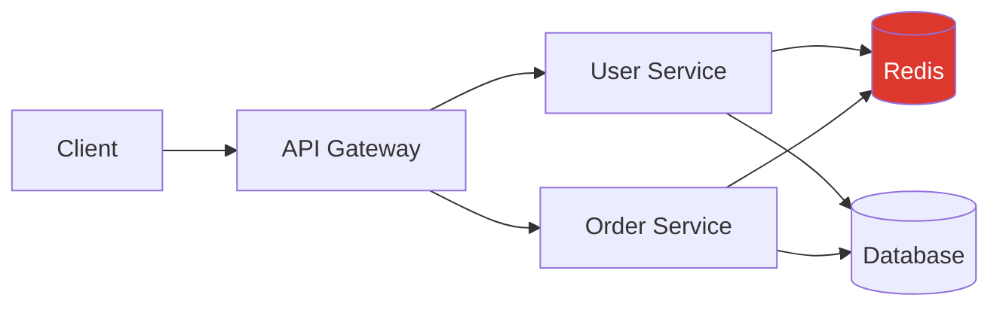

# Visualization

Analyze distributed traces with powerful visualization tools.

## Jaeger UI

Industry-standard trace visualization.

### Setup

```yaml
# docker-compose.yml
version: '3.8'

services:
  jaeger:
    image: jaegertracing/all-in-one:latest
    ports:
      - "16686:16686"  # UI
      - "4318:4318"    # OTLP HTTP
    environment:
      - COLLECTOR_OTLP_ENABLED=true
```

### Access

```
http://localhost:16686
```

### Search Traces

**By Service:**

```
Service: user-service
```

**By Operation:**

```
Operation: GET /api/users/:id
```

**By Tags:**

```
Tags:
  http.status_code = 500
  user.id = 123
  cache.hit = false
```

**By Duration:**

```
Min Duration: 1s
Max Duration: 10s
```

**By Time:**

```
Lookback: Last 1 hour
Custom: 2025-01-28 10:00 to 2025-01-28 11:00
```

### Trace View

```mermaid
gantt
    title Trace Timeline
    dateFormat x
    axisFormat %L ms

    section HTTP
    Request :0, 50

    section Cache
    GET :5, 7

    section Database
    Query :10, 45

    section Cache
    SET :46, 49
```



**Timeline shows:**
- Span duration (bar length)
- Parent-child relationships (indentation)
- Concurrent operations (overlapping bars)
- Critical path (longest chain)

### Span Details

Click any span to see:

**Overview:**
```
Operation: redis.GET
Duration: 1.23ms
Start: 2025-01-28 10:15:23.456
```

**Attributes:**
```json
{
  "db.system": "redis",
  "db.operation": "GET",
  "db.redis.key": "user:123",
  "redisx.plugin": "cache",
  "redisx.cache.hit": false
}
```

**Events:**
```
[2025-01-28 10:15:23.456] cache.lookup
[2025-01-28 10:15:23.458] cache.miss
```

**Logs:**
```
[10:15:23.456] INFO: Cache lookup for user:123
[10:15:23.458] WARN: Cache miss, querying database
```

### Service Dependencies

**System Architecture:**



**Dependency Graph shows:**
- Services called
- Call frequency
- Average latency
- Error rates

### Performance Analysis

**Trace Comparison:**

Compare similar requests to find performance regressions.

```
Baseline (v1.0.0):  50ms
Current (v1.1.0):   150ms
Regression:         +100ms (+200%)

Slowdown in: database.query (10ms → 110ms)
```

**Histogram:**

```
Latency Distribution:
< 10ms:   ████████████████████ 40%
10-50ms:  ██████████████ 28%
50-100ms: ██████ 12%
100-500ms: ████ 15%
> 500ms:  █ 5%
```

## Grafana Tempo

Store and query traces in Grafana.

### Setup

```yaml
# docker-compose.yml
version: '3.8'

services:
  tempo:
    image: grafana/tempo:latest
    ports:
      - "4318:4318"  # OTLP HTTP
      - "3200:3200"  # Tempo API
    volumes:
      - ./tempo.yaml:/etc/tempo.yaml
    command: ["-config.file=/etc/tempo.yaml"]

  grafana:
    image: grafana/grafana:latest
    ports:
      - "3000:3000"
    environment:
      - GF_AUTH_ANONYMOUS_ENABLED=true
      - GF_AUTH_ANONYMOUS_ORG_ROLE=Admin
    volumes:
      - ./grafana-datasources.yaml:/etc/grafana/provisioning/datasources/datasources.yaml
```

### Tempo Configuration

```yaml
# tempo.yaml
server:
  http_listen_port: 3200

distributor:
  receivers:
    otlp:
      protocols:
        http:
          endpoint: 0.0.0.0:4318

storage:
  trace:
    backend: local
    local:
      path: /tmp/tempo/blocks

query_frontend:
  search:
    max_duration: 1h
```

### Grafana Data Source

```yaml
# grafana-datasources.yaml
apiVersion: 1

datasources:
  - name: Tempo
    type: tempo
    access: proxy
    url: http://tempo:3200
    uid: tempo
```

### Access Grafana

```
http://localhost:3000
```

### Explore Traces

**1. Navigate to Explore**

```
Grafana → Explore → Tempo
```

**2. Search by Trace ID**

```
Trace ID: 7f9c8a3b2e1d4c5a6b7e8f9a0b1c2d3e
```

**3. Search by Tags**

```
{
  service.name="user-service"
  http.status_code="500"
  cache.hit="false"
}
```

**4. Search by Duration**

```
duration > 1s
```

### TraceQL

Query language for traces.

**Find slow traces:**

```yaml
{ duration > 1s }
```

**Find errors:**

```yaml
{ status = error }
```

**Find cache misses:**

```yaml
{ redisx.cache.hit = false }
```

**Complex query:**

```yaml
{
  service.name = "user-service" &&
  http.method = "GET" &&
  http.status_code >= 500 &&
  duration > 500ms
}
```

**Aggregate:**

```yaml
{ service.name = "user-service" } | rate() by (http.status_code)
```

### Correlate with Metrics

**Link traces to metrics:**

```yaml
# Find slow requests
histogram_quantile(0.95,
  rate(http_request_duration_seconds_bucket{
    service="user-service"
  }[5m])
) > 1
```

**Then explore traces:**

```
Grafana → Explore → Tempo
Search: { service.name="user-service" duration>1s }
```

### Correlate with Logs

**Link traces to logs:**

```yaml
# promtail-config.yaml
scrape_configs:
  - job_name: app-logs
    static_configs:
      - targets:
          - localhost
        labels:
          job: app-logs
    pipeline_stages:
      - json:
          expressions:
            trace_id: trace_id
      - labels:
          trace_id:
```

**View logs for trace:**

```
Grafana → Explore → Loki
{job="app-logs"} |= "trace_id: abc123"
```

## Dashboards

### Trace Statistics Dashboard

```json
{
  "dashboard": {
    "title": "Trace Analytics",
    "panels": [
      {
        "title": "Request Rate",
        "targets": [{
          "expr": "sum(rate(traces_total[5m])) by (service)"
        }]
      },
      {
        "title": "Error Rate",
        "targets": [{
          "expr": "sum(rate(traces_total{status=\"error\"}[5m])) by (service)"
        }]
      },
      {
        "title": "P95 Latency",
        "targets": [{
          "expr": "histogram_quantile(0.95, rate(trace_duration_seconds_bucket[5m]))"
        }]
      }
    ]
  }
}
```

### Plugin Performance Dashboard

**Cache Performance:**

```yaml
# Cache hit rate
sum(rate(redisx_cache_hits_total[5m])) /
(sum(rate(redisx_cache_hits_total[5m])) + sum(rate(redisx_cache_misses_total[5m])))

# Cache stampede preventions
rate(redisx_cache_stampede_prevented_total[5m])
```

**Lock Contention:**

```yaml
# Active locks
sum(redisx_locks_active)

# Lock wait time
histogram_quantile(0.95,
  rate(redisx_lock_wait_duration_seconds_bucket[5m])
)
```

**Rate Limit:**

```yaml
# Block rate
sum(rate(redisx_ratelimit_requests_total{status="rejected"}[5m])) /
sum(rate(redisx_ratelimit_requests_total[5m]))
```

## Analysis Patterns

### Finding Performance Bottlenecks

**1. Find slowest endpoint:**

```
Search: duration > 1s
Group by: http.target
Sort: Duration DESC
```

**2. Analyze trace:**

```
GET /api/users/123 (2.5s)
├── cache.get (2ms)
├── database.query (2.4s) ← BOTTLENECK!
└── cache.set (3ms)
```

**3. Root cause:**

```
database.query attributes:
  db.statement: "SELECT * FROM users WHERE id = $1"
  db.rows_returned: 1
  db.plan: "Seq Scan on users"  ← Missing index!
```

### Detecting Cache Issues

**1. Find cache misses:**

```yaml
{ redisx.cache.hit = false }
```

**2. Analyze pattern:**

```
99% cache misses for endpoint: GET /api/products/:id

Cause: TTL too short (60s)
Solution: Increase TTL to 300s
```

### Identifying Lock Contention

**1. Find long lock waits:**

```yaml
{ redisx.lock.retry_count > 3 }
```

**2. Analyze contention:**

```
lock.acquire process:order-123 (5s)
├── Event: lock.retry (attempt: 1, waited: 1s)
├── Event: lock.retry (attempt: 2, waited: 2s)
├── Event: lock.retry (attempt: 3, waited: 3s)
└── Event: lock.timeout

Cause: Long-running process holding lock
Solution: Reduce lock TTL or optimize process
```

### Tracking Distributed Transactions

**1. Search by transaction ID:**

```yaml
{ transaction.id = "txn-123" }
```

**2. Trace flow:**

```
Service A: POST /api/orders (500ms)
├── lock.acquire order:123 (2ms)
├── Service B: POST /internal/payment (200ms)
│   ├── lock.acquire payment:123 (2ms)
│   ├── payment.process (180ms)
│   └── lock.release payment:123 (1ms)
├── stream.publish orders (10ms)
└── lock.release order:123 (1ms)
```

## Alerting on Traces

### Grafana Alerts

**High error rate:**

```yaml
sum(rate(traces_total{status="error"}[5m])) /
sum(rate(traces_total[5m])) > 0.05
```

**Slow traces:**

```yaml
histogram_quantile(0.95,
  rate(trace_duration_seconds_bucket[5m])
) > 1
```

**Cache performance degradation:**

```yaml
sum(rate(redisx_cache_hits_total[5m])) /
(sum(rate(redisx_cache_hits_total[5m])) + sum(rate(redisx_cache_misses_total[5m]))) < 0.7
```

## Best Practices

**1. Use meaningful span names**

```typescript
// ✅ Good
'user.get', 'order.create', 'payment.process'

// ❌ Bad
'operation', 'function', 'handler'
```

**2. Add contextual attributes**

```typescript
span.setAttributes({
  'user.id': user.id,
  'user.role': user.role,
  'order.total': order.total,
});
```

**3. Record important events**

```typescript
span.addEvent('validation.started');
span.addEvent('payment.succeeded');
span.addEvent('email.sent');
```

**4. Create dashboards for key metrics**

- Request rate by service
- Error rate by endpoint
- P95/P99 latency
- Cache hit rates
- Lock contention

**5. Set up alerts**

- High error rate
- Slow response times
- Cache degradation
- Lock timeouts

## Tools Comparison

| Feature | Jaeger | Grafana Tempo |
|---------|--------|---------------|
| **UI** | Dedicated trace UI | General observability |
| **Search** | Service, tags, duration | TraceQL |
| **Storage** | Cassandra, Elasticsearch | S3, local, GCS |
| **Correlation** | Traces only | Traces + metrics + logs |
| **Cost** | Lower | Higher (full stack) |
| **Ease of use** | Simple | More features |

## Next Steps

- [Configuration](./configuration) — Configure tracing
- [Spans](./spans) — Create custom spans
- [Troubleshooting](./troubleshooting) — Debug tracing
