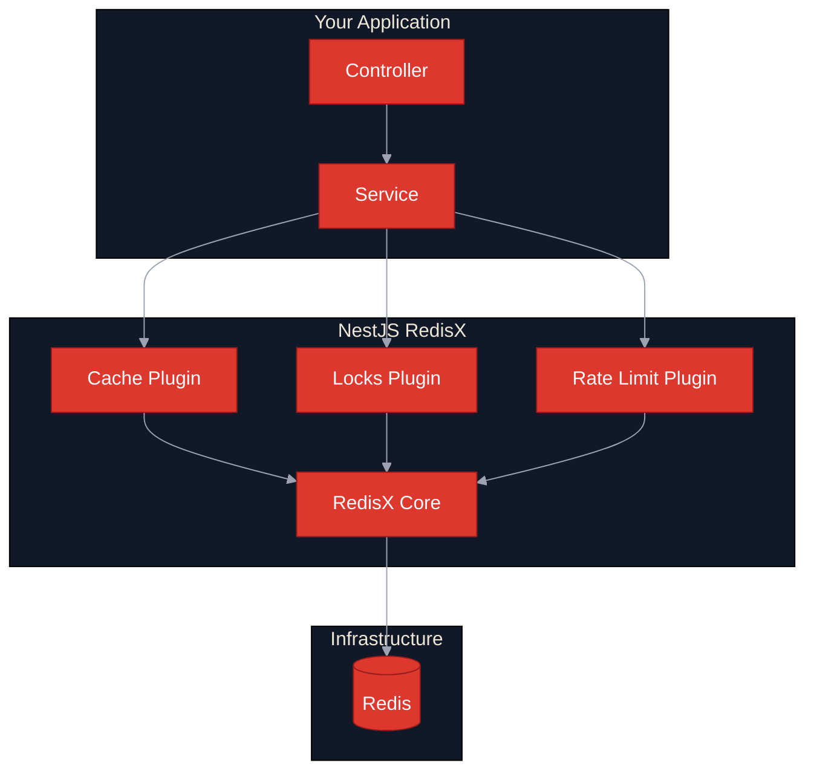
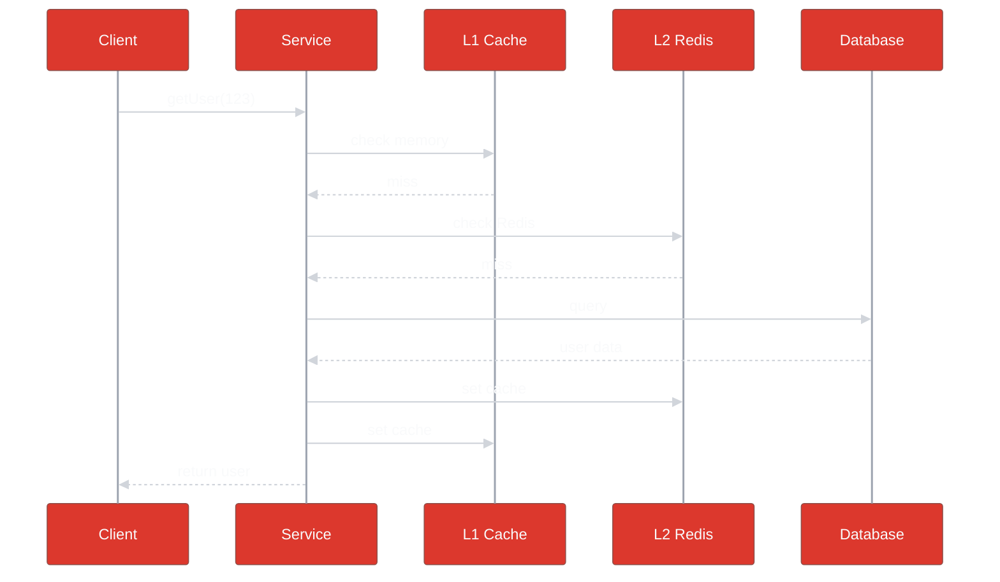
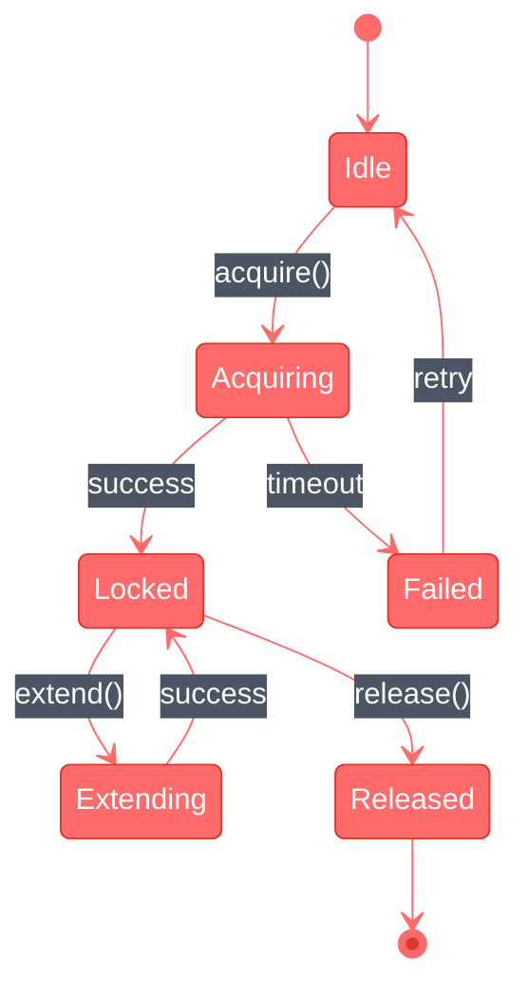
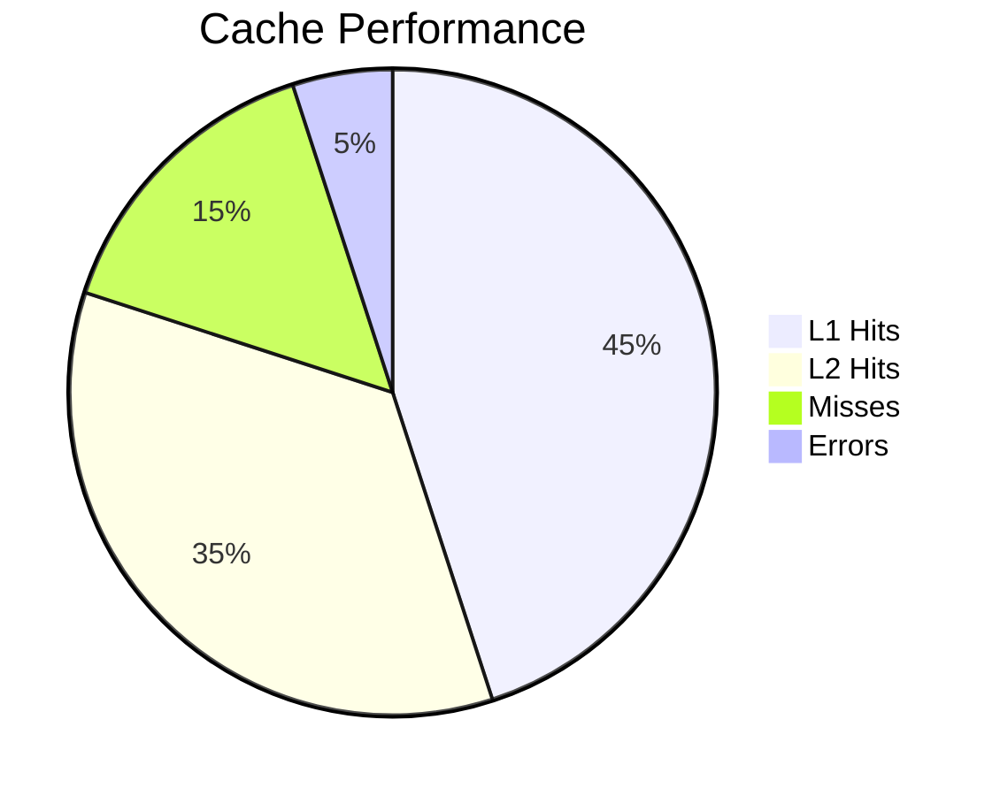
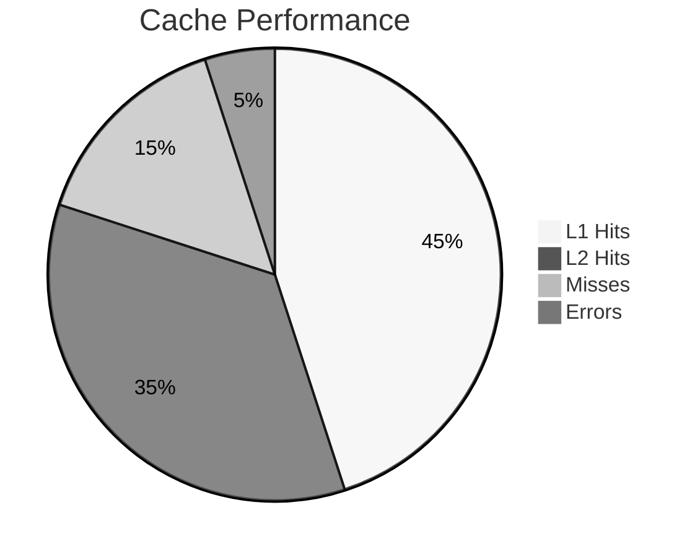
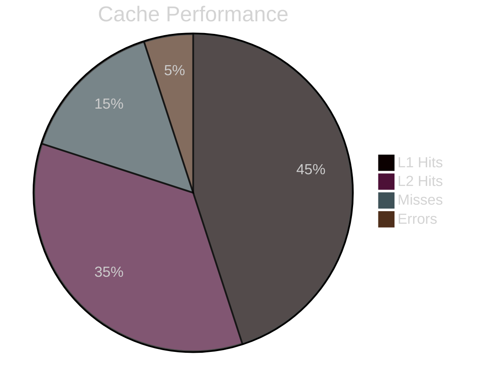
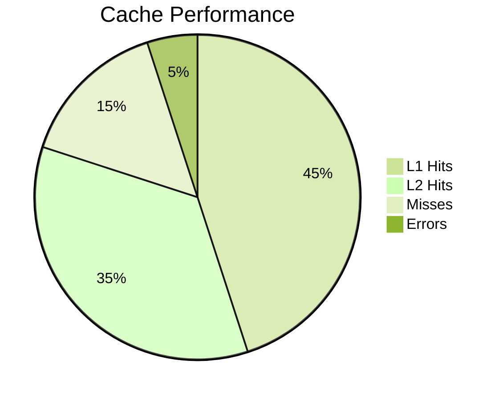
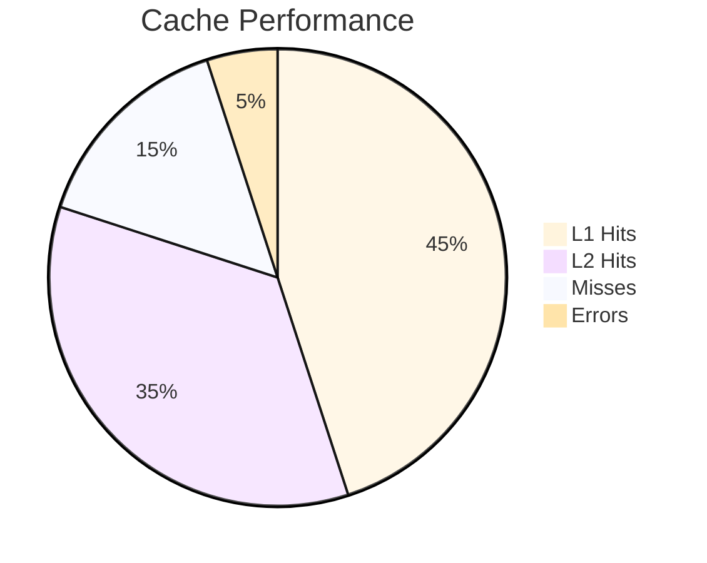

# Mermaid Diagrams - Dark Theme Test

Тестовая страница для выбора стилей диаграмм (тёмная тема).

---

## ВЫБРАНО: Flowchart - Вариант 5 - Muted Professional (без фона)

---

## ВЫБРАНО: Sequence Diagram - Вариант 5 - Muted Professional

---

## ВЫБРАНО: State Diagram - Вариант 1 - Bright Red on Dark

---

## Pie Chart - варианты

### Вариант 1 - Default theme

### Вариант 2 - Neutral theme

### Вариант 3 - Dark theme

### Вариант 4 - Forest theme

### Вариант 5 - Base theme

