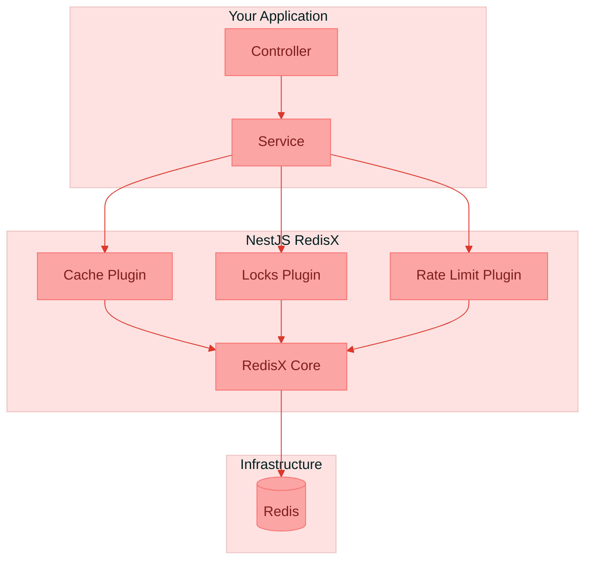
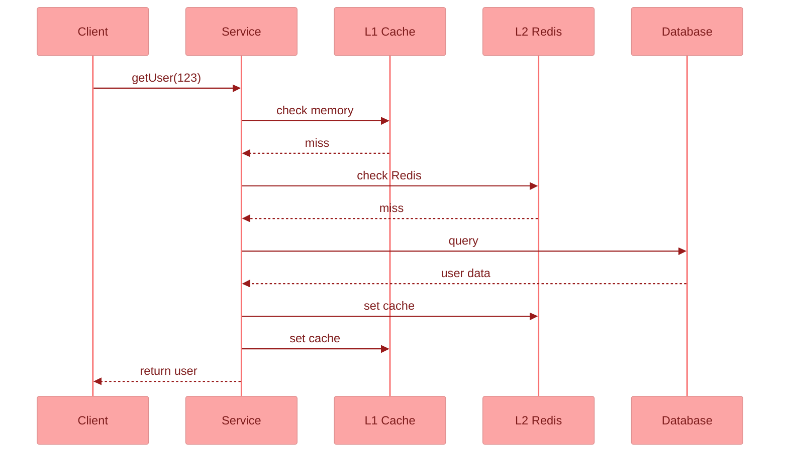
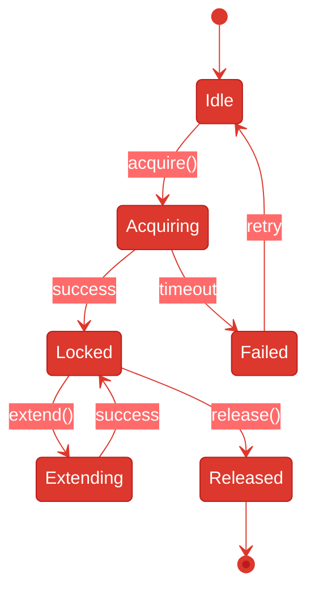
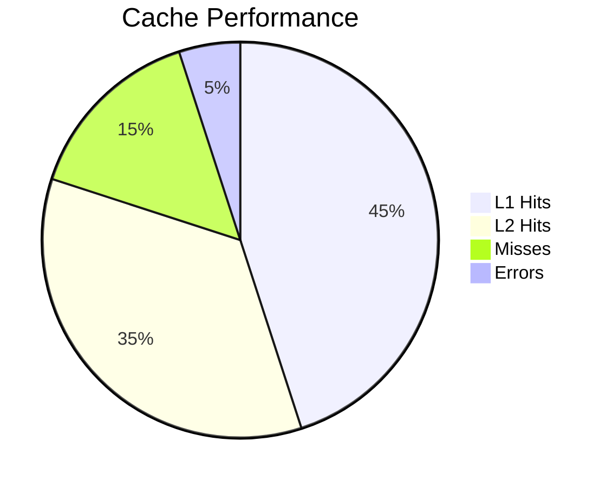
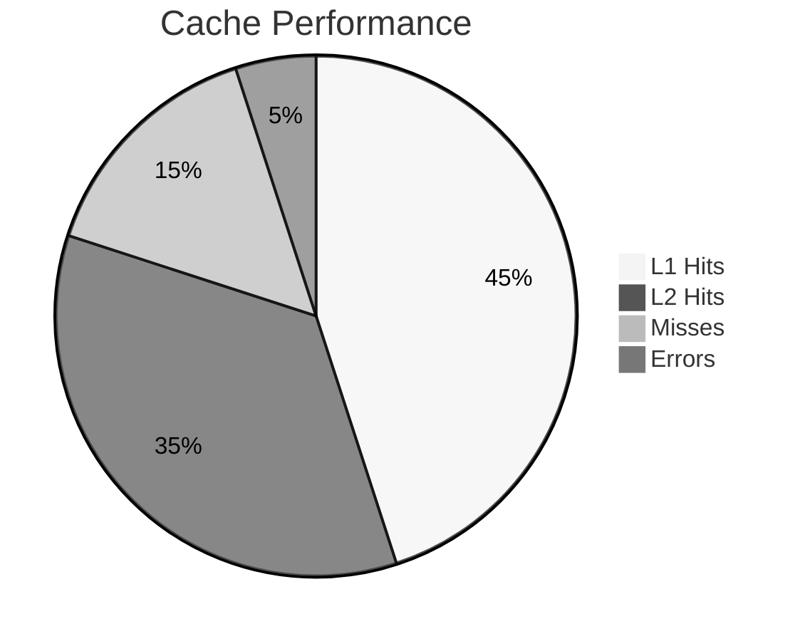
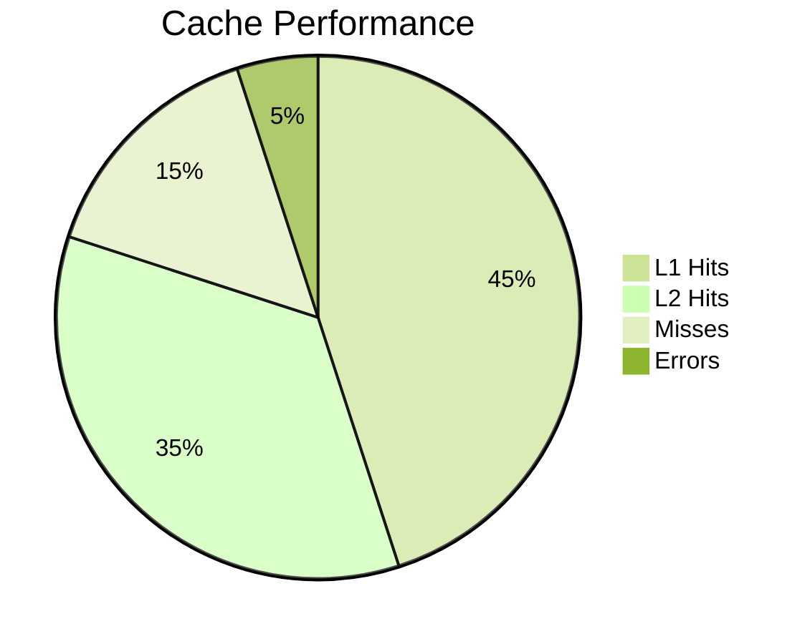
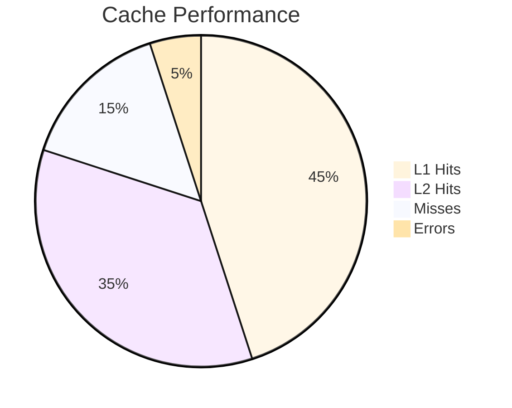
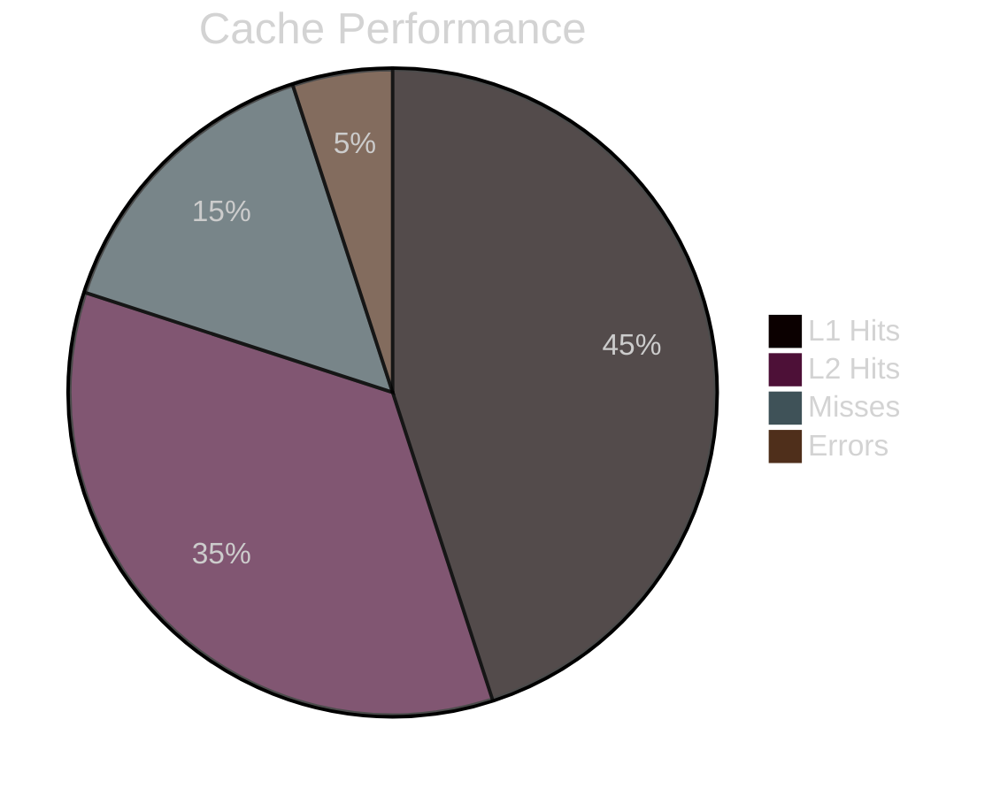

# Mermaid Diagrams - Light Theme Test

Тестовая страница для выбора стилей диаграмм (светлая тема).

---

## ВЫБРАНО: Flowchart - Вариант 5 - Soft Pastels (без фона)

---

## ВЫБРАНО: Sequence Diagram - Вариант 5 - Soft Pastels

---

## ВЫБРАНО: State Diagram - Вариант 1 - Redis Red монохром

---

## Pie Chart - варианты

### Вариант 1 - Default theme

### Вариант 2 - Neutral theme

### Вариант 3 - Forest theme

### Вариант 4 - Base theme

### Вариант 5 - Dark theme

